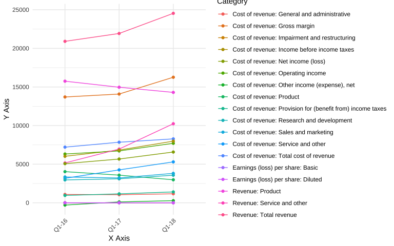
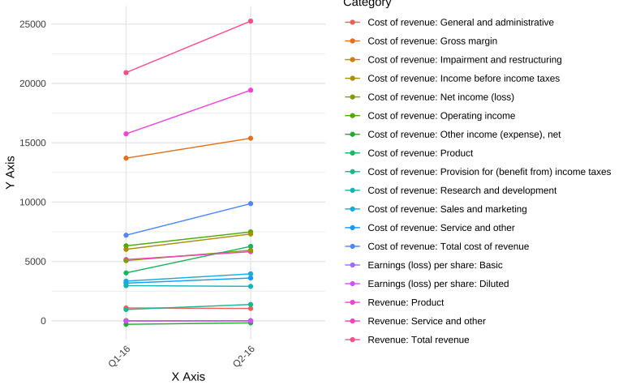

<!-- README.md is generated from README.Rmd. Please edit that file -->

# hierviz

Hierviz provides tools for working with hierarchical category data. It includes functions for:

- Flattening nested categories into fully qualified names
- Creating line charts to visualize trends across categories
- Generating change tables to analyze period-over-period changes

## Installation

To use the package:

``` r
# Install remotes if you haven't already
install.packages("remotes")
remotes::install_github("artemas-radik/hierviz")
```

To develop the package:

``` r
# Install devtools if you haven't already
install.packages("devtools")
devtools::install_github("artemas-radik/hierviz")
```

## Example

First, load the package:

``` r
library(hierviz)
```

Create a query to analyze the data. First we need to flatten the hierarchical categories:

``` r
# Flatten the hierarchical categories (explicitly specify column)
flat_msft <- flatten(msft, "Category")

# Or use the default (first column)
flat_msft <- flatten(msft)
```

``` r
# Create a query with specific columns
q <- query(flat_msft, "Category", c("Q1-16", "Q1-17", "Q1-18"))

# Use the query with visualizations
line_chart(q)
```



``` r
change_table(q)
```

<div id="wisartxtsh" style="padding-left:0px;padding-right:0px;padding-top:10px;padding-bottom:10px;overflow-x:auto;overflow-y:auto;width:auto;height:auto;">
<style>#wisartxtsh table {
  font-family: system-ui, 'Segoe UI', Roboto, Helvetica, Arial, sans-serif, 'Apple Color Emoji', 'Segoe UI Emoji', 'Segoe UI Symbol', 'Noto Color Emoji';
  -webkit-font-smoothing: antialiased;
  -moz-osx-font-smoothing: grayscale;
}
&#10;#wisartxtsh thead, #wisartxtsh tbody, #wisartxtsh tfoot, #wisartxtsh tr, #wisartxtsh td, #wisartxtsh th {
  border-style: none;
}
&#10;#wisartxtsh p {
  margin: 0;
  padding: 0;
}
&#10;#wisartxtsh .gt_table {
  display: table;
  border-collapse: collapse;
  line-height: normal;
  margin-left: auto;
  margin-right: auto;
  color: #333333;
  font-size: small;
  font-weight: normal;
  font-style: normal;
  background-color: #FFFFFF;
  width: auto;
  border-top-style: solid;
  border-top-width: 2px;
  border-top-color: #A8A8A8;
  border-right-style: none;
  border-right-width: 2px;
  border-right-color: #D3D3D3;
  border-bottom-style: solid;
  border-bottom-width: 2px;
  border-bottom-color: #A8A8A8;
  border-left-style: none;
  border-left-width: 2px;
  border-left-color: #D3D3D3;
}
&#10;#wisartxtsh .gt_caption {
  padding-top: 4px;
  padding-bottom: 4px;
}
&#10;#wisartxtsh .gt_title {
  color: #333333;
  font-size: 125%;
  font-weight: initial;
  padding-top: 4px;
  padding-bottom: 4px;
  padding-left: 5px;
  padding-right: 5px;
  border-bottom-color: #FFFFFF;
  border-bottom-width: 0;
}
&#10;#wisartxtsh .gt_subtitle {
  color: #333333;
  font-size: 85%;
  font-weight: initial;
  padding-top: 3px;
  padding-bottom: 5px;
  padding-left: 5px;
  padding-right: 5px;
  border-top-color: #FFFFFF;
  border-top-width: 0;
}
&#10;#wisartxtsh .gt_heading {
  background-color: #FFFFFF;
  text-align: center;
  border-bottom-color: #FFFFFF;
  border-left-style: none;
  border-left-width: 1px;
  border-left-color: #D3D3D3;
  border-right-style: none;
  border-right-width: 1px;
  border-right-color: #D3D3D3;
}
&#10;#wisartxtsh .gt_bottom_border {
  border-bottom-style: solid;
  border-bottom-width: 2px;
  border-bottom-color: #D3D3D3;
}
&#10;#wisartxtsh .gt_col_headings {
  border-top-style: solid;
  border-top-width: 2px;
  border-top-color: #D3D3D3;
  border-bottom-style: solid;
  border-bottom-width: 2px;
  border-bottom-color: #D3D3D3;
  border-left-style: none;
  border-left-width: 1px;
  border-left-color: #D3D3D3;
  border-right-style: none;
  border-right-width: 1px;
  border-right-color: #D3D3D3;
}
&#10;#wisartxtsh .gt_col_heading {
  color: #333333;
  background-color: #FFFFFF;
  font-size: 100%;
  font-weight: normal;
  text-transform: inherit;
  border-left-style: none;
  border-left-width: 1px;
  border-left-color: #D3D3D3;
  border-right-style: none;
  border-right-width: 1px;
  border-right-color: #D3D3D3;
  vertical-align: bottom;
  padding-top: 5px;
  padding-bottom: 6px;
  padding-left: 5px;
  padding-right: 5px;
  overflow-x: hidden;
}
&#10;#wisartxtsh .gt_column_spanner_outer {
  color: #333333;
  background-color: #FFFFFF;
  font-size: 100%;
  font-weight: normal;
  text-transform: inherit;
  padding-top: 0;
  padding-bottom: 0;
  padding-left: 4px;
  padding-right: 4px;
}
&#10;#wisartxtsh .gt_column_spanner_outer:first-child {
  padding-left: 0;
}
&#10;#wisartxtsh .gt_column_spanner_outer:last-child {
  padding-right: 0;
}
&#10;#wisartxtsh .gt_column_spanner {
  border-bottom-style: solid;
  border-bottom-width: 2px;
  border-bottom-color: #D3D3D3;
  vertical-align: bottom;
  padding-top: 5px;
  padding-bottom: 5px;
  overflow-x: hidden;
  display: inline-block;
  width: 100%;
}
&#10;#wisartxtsh .gt_spanner_row {
  border-bottom-style: hidden;
}
&#10;#wisartxtsh .gt_group_heading {
  padding-top: 8px;
  padding-bottom: 8px;
  padding-left: 5px;
  padding-right: 5px;
  color: #333333;
  background-color: #FFFFFF;
  font-size: 100%;
  font-weight: initial;
  text-transform: inherit;
  border-top-style: solid;
  border-top-width: 2px;
  border-top-color: #D3D3D3;
  border-bottom-style: solid;
  border-bottom-width: 2px;
  border-bottom-color: #D3D3D3;
  border-left-style: none;
  border-left-width: 1px;
  border-left-color: #D3D3D3;
  border-right-style: none;
  border-right-width: 1px;
  border-right-color: #D3D3D3;
  vertical-align: middle;
  text-align: left;
}
&#10;#wisartxtsh .gt_empty_group_heading {
  padding: 0.5px;
  color: #333333;
  background-color: #FFFFFF;
  font-size: 100%;
  font-weight: initial;
  border-top-style: solid;
  border-top-width: 2px;
  border-top-color: #D3D3D3;
  border-bottom-style: solid;
  border-bottom-width: 2px;
  border-bottom-color: #D3D3D3;
  vertical-align: middle;
}
&#10;#wisartxtsh .gt_from_md > :first-child {
  margin-top: 0;
}
&#10;#wisartxtsh .gt_from_md > :last-child {
  margin-bottom: 0;
}
&#10;#wisartxtsh .gt_row {
  padding-top: 2px;
  padding-bottom: 2px;
  padding-left: 5px;
  padding-right: 5px;
  margin: 10px;
  border-top-style: solid;
  border-top-width: 1px;
  border-top-color: #D3D3D3;
  border-left-style: none;
  border-left-width: 1px;
  border-left-color: #D3D3D3;
  border-right-style: none;
  border-right-width: 1px;
  border-right-color: #D3D3D3;
  vertical-align: middle;
  overflow-x: hidden;
}
&#10;#wisartxtsh .gt_stub {
  color: #333333;
  background-color: #FFFFFF;
  font-size: 100%;
  font-weight: initial;
  text-transform: inherit;
  border-right-style: solid;
  border-right-width: 2px;
  border-right-color: #D3D3D3;
  padding-left: 5px;
  padding-right: 5px;
}
&#10;#wisartxtsh .gt_stub_row_group {
  color: #333333;
  background-color: #FFFFFF;
  font-size: 100%;
  font-weight: initial;
  text-transform: inherit;
  border-right-style: solid;
  border-right-width: 2px;
  border-right-color: #D3D3D3;
  padding-left: 5px;
  padding-right: 5px;
  vertical-align: top;
}
&#10;#wisartxtsh .gt_row_group_first td {
  border-top-width: 2px;
}
&#10;#wisartxtsh .gt_row_group_first th {
  border-top-width: 2px;
}
&#10;#wisartxtsh .gt_summary_row {
  color: #333333;
  background-color: #FFFFFF;
  text-transform: inherit;
  padding-top: 8px;
  padding-bottom: 8px;
  padding-left: 5px;
  padding-right: 5px;
}
&#10;#wisartxtsh .gt_first_summary_row {
  border-top-style: solid;
  border-top-color: #D3D3D3;
}
&#10;#wisartxtsh .gt_first_summary_row.thick {
  border-top-width: 2px;
}
&#10;#wisartxtsh .gt_last_summary_row {
  padding-top: 8px;
  padding-bottom: 8px;
  padding-left: 5px;
  padding-right: 5px;
  border-bottom-style: solid;
  border-bottom-width: 2px;
  border-bottom-color: #D3D3D3;
}
&#10;#wisartxtsh .gt_grand_summary_row {
  color: #333333;
  background-color: #FFFFFF;
  text-transform: inherit;
  padding-top: 8px;
  padding-bottom: 8px;
  padding-left: 5px;
  padding-right: 5px;
}
&#10;#wisartxtsh .gt_first_grand_summary_row {
  padding-top: 8px;
  padding-bottom: 8px;
  padding-left: 5px;
  padding-right: 5px;
  border-top-style: double;
  border-top-width: 6px;
  border-top-color: #D3D3D3;
}
&#10;#wisartxtsh .gt_last_grand_summary_row_top {
  padding-top: 8px;
  padding-bottom: 8px;
  padding-left: 5px;
  padding-right: 5px;
  border-bottom-style: double;
  border-bottom-width: 6px;
  border-bottom-color: #D3D3D3;
}
&#10;#wisartxtsh .gt_striped {
  background-color: rgba(128, 128, 128, 0.05);
}
&#10;#wisartxtsh .gt_table_body {
  border-top-style: solid;
  border-top-width: 2px;
  border-top-color: #D3D3D3;
  border-bottom-style: solid;
  border-bottom-width: 2px;
  border-bottom-color: #D3D3D3;
}
&#10;#wisartxtsh .gt_footnotes {
  color: #333333;
  background-color: #FFFFFF;
  border-bottom-style: none;
  border-bottom-width: 2px;
  border-bottom-color: #D3D3D3;
  border-left-style: none;
  border-left-width: 2px;
  border-left-color: #D3D3D3;
  border-right-style: none;
  border-right-width: 2px;
  border-right-color: #D3D3D3;
}
&#10;#wisartxtsh .gt_footnote {
  margin: 0px;
  font-size: 90%;
  padding-top: 4px;
  padding-bottom: 4px;
  padding-left: 5px;
  padding-right: 5px;
}
&#10;#wisartxtsh .gt_sourcenotes {
  color: #333333;
  background-color: #FFFFFF;
  border-bottom-style: none;
  border-bottom-width: 2px;
  border-bottom-color: #D3D3D3;
  border-left-style: none;
  border-left-width: 2px;
  border-left-color: #D3D3D3;
  border-right-style: none;
  border-right-width: 2px;
  border-right-color: #D3D3D3;
}
&#10;#wisartxtsh .gt_sourcenote {
  font-size: 90%;
  padding-top: 4px;
  padding-bottom: 4px;
  padding-left: 5px;
  padding-right: 5px;
}
&#10;#wisartxtsh .gt_left {
  text-align: left;
}
&#10;#wisartxtsh .gt_center {
  text-align: center;
}
&#10;#wisartxtsh .gt_right {
  text-align: right;
  font-variant-numeric: tabular-nums;
}
&#10;#wisartxtsh .gt_font_normal {
  font-weight: normal;
}
&#10;#wisartxtsh .gt_font_bold {
  font-weight: bold;
}
&#10;#wisartxtsh .gt_font_italic {
  font-style: italic;
}
&#10;#wisartxtsh .gt_super {
  font-size: 65%;
}
&#10;#wisartxtsh .gt_footnote_marks {
  font-size: 75%;
  vertical-align: 0.4em;
  position: initial;
}
&#10;#wisartxtsh .gt_asterisk {
  font-size: 100%;
  vertical-align: 0;
}
&#10;#wisartxtsh .gt_indent_1 {
  text-indent: 5px;
}
&#10;#wisartxtsh .gt_indent_2 {
  text-indent: 10px;
}
&#10;#wisartxtsh .gt_indent_3 {
  text-indent: 15px;
}
&#10;#wisartxtsh .gt_indent_4 {
  text-indent: 20px;
}
&#10;#wisartxtsh .gt_indent_5 {
  text-indent: 25px;
}
&#10;#wisartxtsh .katex-display {
  display: inline-flex !important;
  margin-bottom: 0.75em !important;
}
&#10;#wisartxtsh div.Reactable > div.rt-table > div.rt-thead > div.rt-tr.rt-tr-group-header > div.rt-th-group:after {
  height: 0px !important;
}
</style>
<table class="gt_table" data-quarto-disable-processing="false" data-quarto-bootstrap="false">
  <thead>
    <tr class="gt_col_headings">
      <th class="gt_col_heading gt_columns_bottom_border gt_left" rowspan="1" colspan="1" scope="col" id="Category">Category</th>
      <th class="gt_col_heading gt_columns_bottom_border gt_right" rowspan="1" colspan="1" scope="col" id="Q1-16">Q1-16</th>
      <th class="gt_col_heading gt_columns_bottom_border gt_right" rowspan="1" colspan="1" scope="col" id="change_1">% Change</th>
      <th class="gt_col_heading gt_columns_bottom_border gt_right" rowspan="1" colspan="1" scope="col" id="Q1-17">Q1-17</th>
      <th class="gt_col_heading gt_columns_bottom_border gt_right" rowspan="1" colspan="1" scope="col" id="change_2">% Change</th>
      <th class="gt_col_heading gt_columns_bottom_border gt_right" rowspan="1" colspan="1" scope="col" id="Q1-18">Q1-18</th>
    </tr>
  </thead>
  <tbody class="gt_table_body">
    <tr><td headers="Category" class="gt_row gt_left">Revenue: Product</td>
<td headers="Q1-16" class="gt_row gt_right">15,750.0</td>
<td headers="change_1" class="gt_row gt_right" style="color: #DC3545;">−5.0%</td>
<td headers="Q1-17" class="gt_row gt_right">14,968.0</td>
<td headers="change_2" class="gt_row gt_right" style="color: #DC3545;">−4.5%</td>
<td headers="Q1-18" class="gt_row gt_right">14,298.0</td></tr>
    <tr><td headers="Category" class="gt_row gt_left">Revenue: Service and other</td>
<td headers="Q1-16" class="gt_row gt_right">5,160.0</td>
<td headers="change_1" class="gt_row gt_right" style="color: #28A745;">34.9%</td>
<td headers="Q1-17" class="gt_row gt_right">6,960.0</td>
<td headers="change_2" class="gt_row gt_right" style="color: #28A745;">47.1%</td>
<td headers="Q1-18" class="gt_row gt_right">10,240.0</td></tr>
    <tr><td headers="Category" class="gt_row gt_left">Revenue: Total revenue</td>
<td headers="Q1-16" class="gt_row gt_right">20,910.0</td>
<td headers="change_1" class="gt_row gt_right" style="color: #28A745;">4.9%</td>
<td headers="Q1-17" class="gt_row gt_right">21,928.0</td>
<td headers="change_2" class="gt_row gt_right" style="color: #28A745;">11.9%</td>
<td headers="Q1-18" class="gt_row gt_right">24,538.0</td></tr>
    <tr><td headers="Category" class="gt_row gt_left">Cost of revenue: Product</td>
<td headers="Q1-16" class="gt_row gt_right">4,035.0</td>
<td headers="change_1" class="gt_row gt_right" style="color: #DC3545;">−11.3%</td>
<td headers="Q1-17" class="gt_row gt_right">3,581.0</td>
<td headers="change_2" class="gt_row gt_right" style="color: #DC3545;">−16.8%</td>
<td headers="Q1-18" class="gt_row gt_right">2,980.0</td></tr>
    <tr><td headers="Category" class="gt_row gt_left">Cost of revenue: Service and other</td>
<td headers="Q1-16" class="gt_row gt_right">3,172.0</td>
<td headers="change_1" class="gt_row gt_right" style="color: #28A745;">34.4%</td>
<td headers="Q1-17" class="gt_row gt_right">4,263.0</td>
<td headers="change_2" class="gt_row gt_right" style="color: #28A745;">24.3%</td>
<td headers="Q1-18" class="gt_row gt_right">5,298.0</td></tr>
    <tr><td headers="Category" class="gt_row gt_left">Cost of revenue: Total cost of revenue</td>
<td headers="Q1-16" class="gt_row gt_right">7,207.0</td>
<td headers="change_1" class="gt_row gt_right" style="color: #28A745;">8.8%</td>
<td headers="Q1-17" class="gt_row gt_right">7,844.0</td>
<td headers="change_2" class="gt_row gt_right" style="color: #28A745;">5.5%</td>
<td headers="Q1-18" class="gt_row gt_right">8,278.0</td></tr>
    <tr><td headers="Category" class="gt_row gt_left">Cost of revenue: Gross margin</td>
<td headers="Q1-16" class="gt_row gt_right">13,703.0</td>
<td headers="change_1" class="gt_row gt_right" style="color: #28A745;">2.8%</td>
<td headers="Q1-17" class="gt_row gt_right">14,084.0</td>
<td headers="change_2" class="gt_row gt_right" style="color: #28A745;">15.5%</td>
<td headers="Q1-18" class="gt_row gt_right">16,260.0</td></tr>
    <tr><td headers="Category" class="gt_row gt_left">Cost of revenue: Research and development</td>
<td headers="Q1-16" class="gt_row gt_right">2,962.0</td>
<td headers="change_1" class="gt_row gt_right" style="color: #28A745;">4.9%</td>
<td headers="Q1-17" class="gt_row gt_right">3,106.0</td>
<td headers="change_2" class="gt_row gt_right" style="color: #28A745;">15.1%</td>
<td headers="Q1-18" class="gt_row gt_right">3,574.0</td></tr>
    <tr><td headers="Category" class="gt_row gt_left">Cost of revenue: Sales and marketing</td>
<td headers="Q1-16" class="gt_row gt_right">3,341.0</td>
<td headers="change_1" class="gt_row gt_right" style="color: #DC3545;">−3.7%</td>
<td headers="Q1-17" class="gt_row gt_right">3,218.0</td>
<td headers="change_2" class="gt_row gt_right" style="color: #28A745;">18.5%</td>
<td headers="Q1-18" class="gt_row gt_right">3,812.0</td></tr>
    <tr><td headers="Category" class="gt_row gt_left">Cost of revenue: General and administrative</td>
<td headers="Q1-16" class="gt_row gt_right">1,084.0</td>
<td headers="change_1" class="gt_row gt_right" style="color: #DC3545;">−3.6%</td>
<td headers="Q1-17" class="gt_row gt_right">1,045.0</td>
<td headers="change_2" class="gt_row gt_right" style="color: #28A745;">11.6%</td>
<td headers="Q1-18" class="gt_row gt_right">1,166.0</td></tr>
    <tr><td headers="Category" class="gt_row gt_left">Cost of revenue: Impairment and restructuring</td>
<td headers="Q1-16" class="gt_row gt_right">0.0</td>
<td headers="change_1" class="gt_row gt_right">0.0%</td>
<td headers="Q1-17" class="gt_row gt_right">0.0</td>
<td headers="change_2" class="gt_row gt_right">0.0%</td>
<td headers="Q1-18" class="gt_row gt_right">0.0</td></tr>
    <tr><td headers="Category" class="gt_row gt_left">Cost of revenue: Operating income</td>
<td headers="Q1-16" class="gt_row gt_right">6,316.0</td>
<td headers="change_1" class="gt_row gt_right" style="color: #28A745;">6.3%</td>
<td headers="Q1-17" class="gt_row gt_right">6,715.0</td>
<td headers="change_2" class="gt_row gt_right" style="color: #28A745;">14.8%</td>
<td headers="Q1-18" class="gt_row gt_right">7,708.0</td></tr>
    <tr><td headers="Category" class="gt_row gt_left">Cost of revenue: Other income (expense), net</td>
<td headers="Q1-16" class="gt_row gt_right">−295.0</td>
<td headers="change_1" class="gt_row gt_right" style="color: #28A745;">138.0%</td>
<td headers="Q1-17" class="gt_row gt_right">112.0</td>
<td headers="change_2" class="gt_row gt_right" style="color: #28A745;">146.4%</td>
<td headers="Q1-18" class="gt_row gt_right">276.0</td></tr>
    <tr><td headers="Category" class="gt_row gt_left">Cost of revenue: Income before income taxes</td>
<td headers="Q1-16" class="gt_row gt_right">6,021.0</td>
<td headers="change_1" class="gt_row gt_right" style="color: #28A745;">13.4%</td>
<td headers="Q1-17" class="gt_row gt_right">6,827.0</td>
<td headers="change_2" class="gt_row gt_right" style="color: #28A745;">16.9%</td>
<td headers="Q1-18" class="gt_row gt_right">7,984.0</td></tr>
    <tr><td headers="Category" class="gt_row gt_left">Cost of revenue: Provision for (benefit from) income taxes</td>
<td headers="Q1-16" class="gt_row gt_right">952.0</td>
<td headers="change_1" class="gt_row gt_right" style="color: #28A745;">21.8%</td>
<td headers="Q1-17" class="gt_row gt_right">1,160.0</td>
<td headers="change_2" class="gt_row gt_right" style="color: #28A745;">21.4%</td>
<td headers="Q1-18" class="gt_row gt_right">1,408.0</td></tr>
    <tr><td headers="Category" class="gt_row gt_left">Cost of revenue: Net income (loss)</td>
<td headers="Q1-16" class="gt_row gt_right">5,069.0</td>
<td headers="change_1" class="gt_row gt_right" style="color: #28A745;">11.8%</td>
<td headers="Q1-17" class="gt_row gt_right">5,667.0</td>
<td headers="change_2" class="gt_row gt_right" style="color: #28A745;">16.0%</td>
<td headers="Q1-18" class="gt_row gt_right">6,576.0</td></tr>
    <tr><td headers="Category" class="gt_row gt_left">Earnings (loss) per share: Basic</td>
<td headers="Q1-16" class="gt_row gt_right">0.6</td>
<td headers="change_1" class="gt_row gt_right" style="color: #28A745;">16.7%</td>
<td headers="Q1-17" class="gt_row gt_right">0.7</td>
<td headers="change_2" class="gt_row gt_right" style="color: #28A745;">14.3%</td>
<td headers="Q1-18" class="gt_row gt_right">0.8</td></tr>
    <tr><td headers="Category" class="gt_row gt_left">Earnings (loss) per share: Diluted</td>
<td headers="Q1-16" class="gt_row gt_right">0.6</td>
<td headers="change_1" class="gt_row gt_right" style="color: #28A745;">16.7%</td>
<td headers="Q1-17" class="gt_row gt_right">0.7</td>
<td headers="change_2" class="gt_row gt_right" style="color: #28A745;">14.3%</td>
<td headers="Q1-18" class="gt_row gt_right">0.8</td></tr>
  </tbody>
  &#10;  
</table>
</div>

The query function has smart defaults. You can use it in several ways:

``` r
# Using defaults (first column as category, rest as data)
q1 <- query(flat_msft)

# Specifying category column but using all remaining columns as data
q2 <- query(flat_msft, "Category")

# Specifying both category and data columns
q3 <- query(flat_msft, "Category", c("Q1-16", "Q2-16"))

# All these will work:
line_chart(q1)
```


``` r
change_table(q2)
```

<div id="hxmkqbzrmh" style="padding-left:0px;padding-right:0px;padding-top:10px;padding-bottom:10px;overflow-x:auto;overflow-y:auto;width:auto;height:auto;">
<style>#hxmkqbzrmh table {
  font-family: system-ui, 'Segoe UI', Roboto, Helvetica, Arial, sans-serif, 'Apple Color Emoji', 'Segoe UI Emoji', 'Segoe UI Symbol', 'Noto Color Emoji';
  -webkit-font-smoothing: antialiased;
  -moz-osx-font-smoothing: grayscale;
}
&#10;#hxmkqbzrmh thead, #hxmkqbzrmh tbody, #hxmkqbzrmh tfoot, #hxmkqbzrmh tr, #hxmkqbzrmh td, #hxmkqbzrmh th {
  border-style: none;
}
&#10;#hxmkqbzrmh p {
  margin: 0;
  padding: 0;
}
&#10;#hxmkqbzrmh .gt_table {
  display: table;
  border-collapse: collapse;
  line-height: normal;
  margin-left: auto;
  margin-right: auto;
  color: #333333;
  font-size: small;
  font-weight: normal;
  font-style: normal;
  background-color: #FFFFFF;
  width: auto;
  border-top-style: solid;
  border-top-width: 2px;
  border-top-color: #A8A8A8;
  border-right-style: none;
  border-right-width: 2px;
  border-right-color: #D3D3D3;
  border-bottom-style: solid;
  border-bottom-width: 2px;
  border-bottom-color: #A8A8A8;
  border-left-style: none;
  border-left-width: 2px;
  border-left-color: #D3D3D3;
}
&#10;#hxmkqbzrmh .gt_caption {
  padding-top: 4px;
  padding-bottom: 4px;
}
&#10;#hxmkqbzrmh .gt_title {
  color: #333333;
  font-size: 125%;
  font-weight: initial;
  padding-top: 4px;
  padding-bottom: 4px;
  padding-left: 5px;
  padding-right: 5px;
  border-bottom-color: #FFFFFF;
  border-bottom-width: 0;
}
&#10;#hxmkqbzrmh .gt_subtitle {
  color: #333333;
  font-size: 85%;
  font-weight: initial;
  padding-top: 3px;
  padding-bottom: 5px;
  padding-left: 5px;
  padding-right: 5px;
  border-top-color: #FFFFFF;
  border-top-width: 0;
}
&#10;#hxmkqbzrmh .gt_heading {
  background-color: #FFFFFF;
  text-align: center;
  border-bottom-color: #FFFFFF;
  border-left-style: none;
  border-left-width: 1px;
  border-left-color: #D3D3D3;
  border-right-style: none;
  border-right-width: 1px;
  border-right-color: #D3D3D3;
}
&#10;#hxmkqbzrmh .gt_bottom_border {
  border-bottom-style: solid;
  border-bottom-width: 2px;
  border-bottom-color: #D3D3D3;
}
&#10;#hxmkqbzrmh .gt_col_headings {
  border-top-style: solid;
  border-top-width: 2px;
  border-top-color: #D3D3D3;
  border-bottom-style: solid;
  border-bottom-width: 2px;
  border-bottom-color: #D3D3D3;
  border-left-style: none;
  border-left-width: 1px;
  border-left-color: #D3D3D3;
  border-right-style: none;
  border-right-width: 1px;
  border-right-color: #D3D3D3;
}
&#10;#hxmkqbzrmh .gt_col_heading {
  color: #333333;
  background-color: #FFFFFF;
  font-size: 100%;
  font-weight: normal;
  text-transform: inherit;
  border-left-style: none;
  border-left-width: 1px;
  border-left-color: #D3D3D3;
  border-right-style: none;
  border-right-width: 1px;
  border-right-color: #D3D3D3;
  vertical-align: bottom;
  padding-top: 5px;
  padding-bottom: 6px;
  padding-left: 5px;
  padding-right: 5px;
  overflow-x: hidden;
}
&#10;#hxmkqbzrmh .gt_column_spanner_outer {
  color: #333333;
  background-color: #FFFFFF;
  font-size: 100%;
  font-weight: normal;
  text-transform: inherit;
  padding-top: 0;
  padding-bottom: 0;
  padding-left: 4px;
  padding-right: 4px;
}
&#10;#hxmkqbzrmh .gt_column_spanner_outer:first-child {
  padding-left: 0;
}
&#10;#hxmkqbzrmh .gt_column_spanner_outer:last-child {
  padding-right: 0;
}
&#10;#hxmkqbzrmh .gt_column_spanner {
  border-bottom-style: solid;
  border-bottom-width: 2px;
  border-bottom-color: #D3D3D3;
  vertical-align: bottom;
  padding-top: 5px;
  padding-bottom: 5px;
  overflow-x: hidden;
  display: inline-block;
  width: 100%;
}
&#10;#hxmkqbzrmh .gt_spanner_row {
  border-bottom-style: hidden;
}
&#10;#hxmkqbzrmh .gt_group_heading {
  padding-top: 8px;
  padding-bottom: 8px;
  padding-left: 5px;
  padding-right: 5px;
  color: #333333;
  background-color: #FFFFFF;
  font-size: 100%;
  font-weight: initial;
  text-transform: inherit;
  border-top-style: solid;
  border-top-width: 2px;
  border-top-color: #D3D3D3;
  border-bottom-style: solid;
  border-bottom-width: 2px;
  border-bottom-color: #D3D3D3;
  border-left-style: none;
  border-left-width: 1px;
  border-left-color: #D3D3D3;
  border-right-style: none;
  border-right-width: 1px;
  border-right-color: #D3D3D3;
  vertical-align: middle;
  text-align: left;
}
&#10;#hxmkqbzrmh .gt_empty_group_heading {
  padding: 0.5px;
  color: #333333;
  background-color: #FFFFFF;
  font-size: 100%;
  font-weight: initial;
  border-top-style: solid;
  border-top-width: 2px;
  border-top-color: #D3D3D3;
  border-bottom-style: solid;
  border-bottom-width: 2px;
  border-bottom-color: #D3D3D3;
  vertical-align: middle;
}
&#10;#hxmkqbzrmh .gt_from_md > :first-child {
  margin-top: 0;
}
&#10;#hxmkqbzrmh .gt_from_md > :last-child {
  margin-bottom: 0;
}
&#10;#hxmkqbzrmh .gt_row {
  padding-top: 2px;
  padding-bottom: 2px;
  padding-left: 5px;
  padding-right: 5px;
  margin: 10px;
  border-top-style: solid;
  border-top-width: 1px;
  border-top-color: #D3D3D3;
  border-left-style: none;
  border-left-width: 1px;
  border-left-color: #D3D3D3;
  border-right-style: none;
  border-right-width: 1px;
  border-right-color: #D3D3D3;
  vertical-align: middle;
  overflow-x: hidden;
}
&#10;#hxmkqbzrmh .gt_stub {
  color: #333333;
  background-color: #FFFFFF;
  font-size: 100%;
  font-weight: initial;
  text-transform: inherit;
  border-right-style: solid;
  border-right-width: 2px;
  border-right-color: #D3D3D3;
  padding-left: 5px;
  padding-right: 5px;
}
&#10;#hxmkqbzrmh .gt_stub_row_group {
  color: #333333;
  background-color: #FFFFFF;
  font-size: 100%;
  font-weight: initial;
  text-transform: inherit;
  border-right-style: solid;
  border-right-width: 2px;
  border-right-color: #D3D3D3;
  padding-left: 5px;
  padding-right: 5px;
  vertical-align: top;
}
&#10;#hxmkqbzrmh .gt_row_group_first td {
  border-top-width: 2px;
}
&#10;#hxmkqbzrmh .gt_row_group_first th {
  border-top-width: 2px;
}
&#10;#hxmkqbzrmh .gt_summary_row {
  color: #333333;
  background-color: #FFFFFF;
  text-transform: inherit;
  padding-top: 8px;
  padding-bottom: 8px;
  padding-left: 5px;
  padding-right: 5px;
}
&#10;#hxmkqbzrmh .gt_first_summary_row {
  border-top-style: solid;
  border-top-color: #D3D3D3;
}
&#10;#hxmkqbzrmh .gt_first_summary_row.thick {
  border-top-width: 2px;
}
&#10;#hxmkqbzrmh .gt_last_summary_row {
  padding-top: 8px;
  padding-bottom: 8px;
  padding-left: 5px;
  padding-right: 5px;
  border-bottom-style: solid;
  border-bottom-width: 2px;
  border-bottom-color: #D3D3D3;
}
&#10;#hxmkqbzrmh .gt_grand_summary_row {
  color: #333333;
  background-color: #FFFFFF;
  text-transform: inherit;
  padding-top: 8px;
  padding-bottom: 8px;
  padding-left: 5px;
  padding-right: 5px;
}
&#10;#hxmkqbzrmh .gt_first_grand_summary_row {
  padding-top: 8px;
  padding-bottom: 8px;
  padding-left: 5px;
  padding-right: 5px;
  border-top-style: double;
  border-top-width: 6px;
  border-top-color: #D3D3D3;
}
&#10;#hxmkqbzrmh .gt_last_grand_summary_row_top {
  padding-top: 8px;
  padding-bottom: 8px;
  padding-left: 5px;
  padding-right: 5px;
  border-bottom-style: double;
  border-bottom-width: 6px;
  border-bottom-color: #D3D3D3;
}
&#10;#hxmkqbzrmh .gt_striped {
  background-color: rgba(128, 128, 128, 0.05);
}
&#10;#hxmkqbzrmh .gt_table_body {
  border-top-style: solid;
  border-top-width: 2px;
  border-top-color: #D3D3D3;
  border-bottom-style: solid;
  border-bottom-width: 2px;
  border-bottom-color: #D3D3D3;
}
&#10;#hxmkqbzrmh .gt_footnotes {
  color: #333333;
  background-color: #FFFFFF;
  border-bottom-style: none;
  border-bottom-width: 2px;
  border-bottom-color: #D3D3D3;
  border-left-style: none;
  border-left-width: 2px;
  border-left-color: #D3D3D3;
  border-right-style: none;
  border-right-width: 2px;
  border-right-color: #D3D3D3;
}
&#10;#hxmkqbzrmh .gt_footnote {
  margin: 0px;
  font-size: 90%;
  padding-top: 4px;
  padding-bottom: 4px;
  padding-left: 5px;
  padding-right: 5px;
}
&#10;#hxmkqbzrmh .gt_sourcenotes {
  color: #333333;
  background-color: #FFFFFF;
  border-bottom-style: none;
  border-bottom-width: 2px;
  border-bottom-color: #D3D3D3;
  border-left-style: none;
  border-left-width: 2px;
  border-left-color: #D3D3D3;
  border-right-style: none;
  border-right-width: 2px;
  border-right-color: #D3D3D3;
}
&#10;#hxmkqbzrmh .gt_sourcenote {
  font-size: 90%;
  padding-top: 4px;
  padding-bottom: 4px;
  padding-left: 5px;
  padding-right: 5px;
}
&#10;#hxmkqbzrmh .gt_left {
  text-align: left;
}
&#10;#hxmkqbzrmh .gt_center {
  text-align: center;
}
&#10;#hxmkqbzrmh .gt_right {
  text-align: right;
  font-variant-numeric: tabular-nums;
}
&#10;#hxmkqbzrmh .gt_font_normal {
  font-weight: normal;
}
&#10;#hxmkqbzrmh .gt_font_bold {
  font-weight: bold;
}
&#10;#hxmkqbzrmh .gt_font_italic {
  font-style: italic;
}
&#10;#hxmkqbzrmh .gt_super {
  font-size: 65%;
}
&#10;#hxmkqbzrmh .gt_footnote_marks {
  font-size: 75%;
  vertical-align: 0.4em;
  position: initial;
}
&#10;#hxmkqbzrmh .gt_asterisk {
  font-size: 100%;
  vertical-align: 0;
}
&#10;#hxmkqbzrmh .gt_indent_1 {
  text-indent: 5px;
}
&#10;#hxmkqbzrmh .gt_indent_2 {
  text-indent: 10px;
}
&#10;#hxmkqbzrmh .gt_indent_3 {
  text-indent: 15px;
}
&#10;#hxmkqbzrmh .gt_indent_4 {
  text-indent: 20px;
}
&#10;#hxmkqbzrmh .gt_indent_5 {
  text-indent: 25px;
}
&#10;#hxmkqbzrmh .katex-display {
  display: inline-flex !important;
  margin-bottom: 0.75em !important;
}
&#10;#hxmkqbzrmh div.Reactable > div.rt-table > div.rt-thead > div.rt-tr.rt-tr-group-header > div.rt-th-group:after {
  height: 0px !important;
}
</style>
<table class="gt_table" data-quarto-disable-processing="false" data-quarto-bootstrap="false">
  <thead>
    <tr class="gt_col_headings">
      <th class="gt_col_heading gt_columns_bottom_border gt_left" rowspan="1" colspan="1" scope="col" id="Category">Category</th>
      <th class="gt_col_heading gt_columns_bottom_border gt_right" rowspan="1" colspan="1" scope="col" id="Q1-16">Q1-16</th>
      <th class="gt_col_heading gt_columns_bottom_border gt_right" rowspan="1" colspan="1" scope="col" id="change_1">% Change</th>
      <th class="gt_col_heading gt_columns_bottom_border gt_right" rowspan="1" colspan="1" scope="col" id="Q2-16">Q2-16</th>
      <th class="gt_col_heading gt_columns_bottom_border gt_right" rowspan="1" colspan="1" scope="col" id="change_2">% Change</th>
      <th class="gt_col_heading gt_columns_bottom_border gt_right" rowspan="1" colspan="1" scope="col" id="Q3-16">Q3-16</th>
      <th class="gt_col_heading gt_columns_bottom_border gt_right" rowspan="1" colspan="1" scope="col" id="change_3">% Change</th>
      <th class="gt_col_heading gt_columns_bottom_border gt_right" rowspan="1" colspan="1" scope="col" id="Q4-16">Q4-16</th>
      <th class="gt_col_heading gt_columns_bottom_border gt_right" rowspan="1" colspan="1" scope="col" id="change_4">% Change</th>
      <th class="gt_col_heading gt_columns_bottom_border gt_right" rowspan="1" colspan="1" scope="col" id="Q1-17">Q1-17</th>
      <th class="gt_col_heading gt_columns_bottom_border gt_right" rowspan="1" colspan="1" scope="col" id="change_5">% Change</th>
      <th class="gt_col_heading gt_columns_bottom_border gt_right" rowspan="1" colspan="1" scope="col" id="Q2-17">Q2-17</th>
      <th class="gt_col_heading gt_columns_bottom_border gt_right" rowspan="1" colspan="1" scope="col" id="change_6">% Change</th>
      <th class="gt_col_heading gt_columns_bottom_border gt_right" rowspan="1" colspan="1" scope="col" id="Q3-17">Q3-17</th>
      <th class="gt_col_heading gt_columns_bottom_border gt_right" rowspan="1" colspan="1" scope="col" id="change_7">% Change</th>
      <th class="gt_col_heading gt_columns_bottom_border gt_right" rowspan="1" colspan="1" scope="col" id="Q4-17">Q4-17</th>
      <th class="gt_col_heading gt_columns_bottom_border gt_right" rowspan="1" colspan="1" scope="col" id="change_8">% Change</th>
      <th class="gt_col_heading gt_columns_bottom_border gt_right" rowspan="1" colspan="1" scope="col" id="Q1-18">Q1-18</th>
      <th class="gt_col_heading gt_columns_bottom_border gt_right" rowspan="1" colspan="1" scope="col" id="change_9">% Change</th>
      <th class="gt_col_heading gt_columns_bottom_border gt_right" rowspan="1" colspan="1" scope="col" id="Q2-18">Q2-18</th>
      <th class="gt_col_heading gt_columns_bottom_border gt_right" rowspan="1" colspan="1" scope="col" id="change_10">% Change</th>
      <th class="gt_col_heading gt_columns_bottom_border gt_right" rowspan="1" colspan="1" scope="col" id="Q3-18">Q3-18</th>
      <th class="gt_col_heading gt_columns_bottom_border gt_right" rowspan="1" colspan="1" scope="col" id="change_11">% Change</th>
      <th class="gt_col_heading gt_columns_bottom_border gt_right" rowspan="1" colspan="1" scope="col" id="Q4-18">Q4-18</th>
      <th class="gt_col_heading gt_columns_bottom_border gt_right" rowspan="1" colspan="1" scope="col" id="change_12">% Change</th>
      <th class="gt_col_heading gt_columns_bottom_border gt_right" rowspan="1" colspan="1" scope="col" id="Q1-19">Q1-19</th>
      <th class="gt_col_heading gt_columns_bottom_border gt_right" rowspan="1" colspan="1" scope="col" id="change_13">% Change</th>
      <th class="gt_col_heading gt_columns_bottom_border gt_right" rowspan="1" colspan="1" scope="col" id="Q2-19">Q2-19</th>
      <th class="gt_col_heading gt_columns_bottom_border gt_right" rowspan="1" colspan="1" scope="col" id="change_14">% Change</th>
      <th class="gt_col_heading gt_columns_bottom_border gt_right" rowspan="1" colspan="1" scope="col" id="Q3-19">Q3-19</th>
      <th class="gt_col_heading gt_columns_bottom_border gt_right" rowspan="1" colspan="1" scope="col" id="change_15">% Change</th>
      <th class="gt_col_heading gt_columns_bottom_border gt_right" rowspan="1" colspan="1" scope="col" id="Q4-19">Q4-19</th>
      <th class="gt_col_heading gt_columns_bottom_border gt_right" rowspan="1" colspan="1" scope="col" id="change_16">% Change</th>
      <th class="gt_col_heading gt_columns_bottom_border gt_right" rowspan="1" colspan="1" scope="col" id="Q1-20">Q1-20</th>
      <th class="gt_col_heading gt_columns_bottom_border gt_right" rowspan="1" colspan="1" scope="col" id="change_17">% Change</th>
      <th class="gt_col_heading gt_columns_bottom_border gt_right" rowspan="1" colspan="1" scope="col" id="Q2-20">Q2-20</th>
      <th class="gt_col_heading gt_columns_bottom_border gt_right" rowspan="1" colspan="1" scope="col" id="change_18">% Change</th>
      <th class="gt_col_heading gt_columns_bottom_border gt_right" rowspan="1" colspan="1" scope="col" id="Q3-20">Q3-20</th>
      <th class="gt_col_heading gt_columns_bottom_border gt_right" rowspan="1" colspan="1" scope="col" id="change_19">% Change</th>
      <th class="gt_col_heading gt_columns_bottom_border gt_right" rowspan="1" colspan="1" scope="col" id="Q4-20">Q4-20</th>
      <th class="gt_col_heading gt_columns_bottom_border gt_right" rowspan="1" colspan="1" scope="col" id="change_20">% Change</th>
      <th class="gt_col_heading gt_columns_bottom_border gt_right" rowspan="1" colspan="1" scope="col" id="Q1-21">Q1-21</th>
      <th class="gt_col_heading gt_columns_bottom_border gt_right" rowspan="1" colspan="1" scope="col" id="change_21">% Change</th>
      <th class="gt_col_heading gt_columns_bottom_border gt_right" rowspan="1" colspan="1" scope="col" id="Q2-21">Q2-21</th>
      <th class="gt_col_heading gt_columns_bottom_border gt_right" rowspan="1" colspan="1" scope="col" id="change_22">% Change</th>
      <th class="gt_col_heading gt_columns_bottom_border gt_right" rowspan="1" colspan="1" scope="col" id="Q3-21">Q3-21</th>
      <th class="gt_col_heading gt_columns_bottom_border gt_right" rowspan="1" colspan="1" scope="col" id="change_23">% Change</th>
      <th class="gt_col_heading gt_columns_bottom_border gt_right" rowspan="1" colspan="1" scope="col" id="Q4-21">Q4-21</th>
      <th class="gt_col_heading gt_columns_bottom_border gt_right" rowspan="1" colspan="1" scope="col" id="change_24">% Change</th>
      <th class="gt_col_heading gt_columns_bottom_border gt_right" rowspan="1" colspan="1" scope="col" id="Q1-22">Q1-22</th>
      <th class="gt_col_heading gt_columns_bottom_border gt_right" rowspan="1" colspan="1" scope="col" id="change_25">% Change</th>
      <th class="gt_col_heading gt_columns_bottom_border gt_right" rowspan="1" colspan="1" scope="col" id="Q2-22">Q2-22</th>
      <th class="gt_col_heading gt_columns_bottom_border gt_right" rowspan="1" colspan="1" scope="col" id="change_26">% Change</th>
      <th class="gt_col_heading gt_columns_bottom_border gt_right" rowspan="1" colspan="1" scope="col" id="Q3-22">Q3-22</th>
      <th class="gt_col_heading gt_columns_bottom_border gt_right" rowspan="1" colspan="1" scope="col" id="change_27">% Change</th>
      <th class="gt_col_heading gt_columns_bottom_border gt_right" rowspan="1" colspan="1" scope="col" id="Q4-22">Q4-22</th>
      <th class="gt_col_heading gt_columns_bottom_border gt_right" rowspan="1" colspan="1" scope="col" id="change_28">% Change</th>
      <th class="gt_col_heading gt_columns_bottom_border gt_right" rowspan="1" colspan="1" scope="col" id="Q1-23">Q1-23</th>
      <th class="gt_col_heading gt_columns_bottom_border gt_right" rowspan="1" colspan="1" scope="col" id="change_29">% Change</th>
      <th class="gt_col_heading gt_columns_bottom_border gt_right" rowspan="1" colspan="1" scope="col" id="Q2-23">Q2-23</th>
      <th class="gt_col_heading gt_columns_bottom_border gt_right" rowspan="1" colspan="1" scope="col" id="change_30">% Change</th>
      <th class="gt_col_heading gt_columns_bottom_border gt_right" rowspan="1" colspan="1" scope="col" id="Q3-23">Q3-23</th>
      <th class="gt_col_heading gt_columns_bottom_border gt_right" rowspan="1" colspan="1" scope="col" id="change_31">% Change</th>
      <th class="gt_col_heading gt_columns_bottom_border gt_right" rowspan="1" colspan="1" scope="col" id="Q4-23">Q4-23</th>
      <th class="gt_col_heading gt_columns_bottom_border gt_right" rowspan="1" colspan="1" scope="col" id="change_32">% Change</th>
      <th class="gt_col_heading gt_columns_bottom_border gt_right" rowspan="1" colspan="1" scope="col" id="Q1-24">Q1-24</th>
      <th class="gt_col_heading gt_columns_bottom_border gt_right" rowspan="1" colspan="1" scope="col" id="change_33">% Change</th>
      <th class="gt_col_heading gt_columns_bottom_border gt_right" rowspan="1" colspan="1" scope="col" id="Q2-24">Q2-24</th>
      <th class="gt_col_heading gt_columns_bottom_border gt_right" rowspan="1" colspan="1" scope="col" id="change_34">% Change</th>
      <th class="gt_col_heading gt_columns_bottom_border gt_right" rowspan="1" colspan="1" scope="col" id="Q3-24">Q3-24</th>
      <th class="gt_col_heading gt_columns_bottom_border gt_right" rowspan="1" colspan="1" scope="col" id="change_35">% Change</th>
      <th class="gt_col_heading gt_columns_bottom_border gt_right" rowspan="1" colspan="1" scope="col" id="Q4-24">Q4-24</th>
      <th class="gt_col_heading gt_columns_bottom_border gt_right" rowspan="1" colspan="1" scope="col" id="change_36">% Change</th>
      <th class="gt_col_heading gt_columns_bottom_border gt_right" rowspan="1" colspan="1" scope="col" id="Q1-25">Q1-25</th>
    </tr>
  </thead>
  <tbody class="gt_table_body">
    <tr><td headers="Category" class="gt_row gt_left">Revenue: Product</td>
<td headers="Q1-16" class="gt_row gt_right">15,750.0</td>
<td headers="change_1" class="gt_row gt_right" style="color: #28A745;">23.4%</td>
<td headers="Q2-16" class="gt_row gt_right">19,431.0</td>
<td headers="change_2" class="gt_row gt_right" style="color: #DC3545;">−21.2%</td>
<td headers="Q3-16" class="gt_row gt_right">15,307.0</td>
<td headers="change_3" class="gt_row gt_right" style="color: #28A745;">10.1%</td>
<td headers="Q4-16" class="gt_row gt_right">16,848.0</td>
<td headers="change_4" class="gt_row gt_right" style="color: #DC3545;">−11.2%</td>
<td headers="Q1-17" class="gt_row gt_right">14,968.0</td>
<td headers="change_5" class="gt_row gt_right" style="color: #28A745;">22.1%</td>
<td headers="Q2-17" class="gt_row gt_right">18,273.0</td>
<td headers="change_6" class="gt_row gt_right" style="color: #DC3545;">−20.6%</td>
<td headers="Q3-17" class="gt_row gt_right">14,513.0</td>
<td headers="change_7" class="gt_row gt_right" style="color: #28A745;">10.6%</td>
<td headers="Q4-17" class="gt_row gt_right">16,057.0</td>
<td headers="change_8" class="gt_row gt_right" style="color: #DC3545;">−11.0%</td>
<td headers="Q1-18" class="gt_row gt_right">14,298.0</td>
<td headers="change_9" class="gt_row gt_right" style="color: #28A745;">25.4%</td>
<td headers="Q2-18" class="gt_row gt_right">17,926.0</td>
<td headers="change_10" class="gt_row gt_right" style="color: #DC3545;">−15.7%</td>
<td headers="Q3-18" class="gt_row gt_right">15,114.0</td>
<td headers="change_11" class="gt_row gt_right" style="color: #28A745;">13.5%</td>
<td headers="Q4-18" class="gt_row gt_right">17,159.0</td>
<td headers="change_12" class="gt_row gt_right" style="color: #28A745;">0.8%</td>
<td headers="Q1-19" class="gt_row gt_right">17,299.0</td>
<td headers="change_13" class="gt_row gt_right" style="color: #DC3545;">−6.2%</td>
<td headers="Q2-19" class="gt_row gt_right">16,219.0</td>
<td headers="change_14" class="gt_row gt_right" style="color: #DC3545;">−4.8%</td>
<td headers="Q3-19" class="gt_row gt_right">15,448.0</td>
<td headers="change_15" class="gt_row gt_right" style="color: #28A745;">10.7%</td>
<td headers="Q4-19" class="gt_row gt_right">17,103.0</td>
<td headers="change_16" class="gt_row gt_right" style="color: #DC3545;">−7.8%</td>
<td headers="Q1-20" class="gt_row gt_right">15,768.0</td>
<td headers="change_17" class="gt_row gt_right" style="color: #28A745;">15.8%</td>
<td headers="Q2-20" class="gt_row gt_right">18,255.0</td>
<td headers="change_18" class="gt_row gt_right" style="color: #DC3545;">−13.1%</td>
<td headers="Q3-20" class="gt_row gt_right">15,871.0</td>
<td headers="change_19" class="gt_row gt_right" style="color: #28A745;">14.3%</td>
<td headers="Q4-20" class="gt_row gt_right">18,147.0</td>
<td headers="change_20" class="gt_row gt_right" style="color: #DC3545;">−12.9%</td>
<td headers="Q1-21" class="gt_row gt_right">15,803.0</td>
<td headers="change_21" class="gt_row gt_right" style="color: #28A745;">23.1%</td>
<td headers="Q2-21" class="gt_row gt_right">19,460.0</td>
<td headers="change_22" class="gt_row gt_right" style="color: #DC3545;">−13.3%</td>
<td headers="Q3-21" class="gt_row gt_right">16,873.0</td>
<td headers="change_23" class="gt_row gt_right" style="color: #28A745;">12.2%</td>
<td headers="Q4-21" class="gt_row gt_right">18,938.0</td>
<td headers="change_24" class="gt_row gt_right" style="color: #DC3545;">−12.2%</td>
<td headers="Q1-22" class="gt_row gt_right">16,631.0</td>
<td headers="change_25" class="gt_row gt_right" style="color: #28A745;">24.9%</td>
<td headers="Q2-22" class="gt_row gt_right">20,779.0</td>
<td headers="change_26" class="gt_row gt_right" style="color: #DC3545;">−16.4%</td>
<td headers="Q3-22" class="gt_row gt_right">17,366.0</td>
<td headers="change_27" class="gt_row gt_right" style="color: #28A745;">3.4%</td>
<td headers="Q4-22" class="gt_row gt_right">17,956.0</td>
<td headers="change_28" class="gt_row gt_right" style="color: #DC3545;">−12.3%</td>
<td headers="Q1-23" class="gt_row gt_right">15,741.0</td>
<td headers="change_29" class="gt_row gt_right" style="color: #28A745;">4.9%</td>
<td headers="Q2-23" class="gt_row gt_right">16,517.0</td>
<td headers="change_30" class="gt_row gt_right" style="color: #DC3545;">−5.6%</td>
<td headers="Q3-23" class="gt_row gt_right">15,588.0</td>
<td headers="change_31" class="gt_row gt_right" style="color: #28A745;">8.1%</td>
<td headers="Q4-23" class="gt_row gt_right">16,853.0</td>
<td headers="change_32" class="gt_row gt_right" style="color: #DC3545;">−7.8%</td>
<td headers="Q1-24" class="gt_row gt_right">15,535.0</td>
<td headers="change_33" class="gt_row gt_right" style="color: #28A745;">21.9%</td>
<td headers="Q2-24" class="gt_row gt_right">18,941.0</td>
<td headers="change_34" class="gt_row gt_right" style="color: #DC3545;">−9.8%</td>
<td headers="Q3-24" class="gt_row gt_right">17,080.0</td>
<td headers="change_35" class="gt_row gt_right" style="color: #DC3545;">−22.6%</td>
<td headers="Q4-24" class="gt_row gt_right">13,217.0</td>
<td headers="change_36" class="gt_row gt_right" style="color: #28A745;">15.5%</td>
<td headers="Q1-25" class="gt_row gt_right">15,272.0</td></tr>
    <tr><td headers="Category" class="gt_row gt_left">Revenue: Service and other</td>
<td headers="Q1-16" class="gt_row gt_right">5,160.0</td>
<td headers="change_1" class="gt_row gt_right" style="color: #28A745;">12.8%</td>
<td headers="Q2-16" class="gt_row gt_right">5,822.0</td>
<td headers="change_2" class="gt_row gt_right" style="color: #28A745;">6.7%</td>
<td headers="Q3-16" class="gt_row gt_right">6,210.0</td>
<td headers="change_3" class="gt_row gt_right" style="color: #28A745;">6.7%</td>
<td headers="Q4-16" class="gt_row gt_right">6,626.0</td>
<td headers="change_4" class="gt_row gt_right" style="color: #28A745;">5.0%</td>
<td headers="Q1-17" class="gt_row gt_right">6,960.0</td>
<td headers="change_5" class="gt_row gt_right" style="color: #28A745;">8.5%</td>
<td headers="Q2-17" class="gt_row gt_right">7,553.0</td>
<td headers="change_6" class="gt_row gt_right" style="color: #28A745;">15.2%</td>
<td headers="Q3-17" class="gt_row gt_right">8,699.0</td>
<td headers="change_7" class="gt_row gt_right" style="color: #28A745;">9.8%</td>
<td headers="Q4-17" class="gt_row gt_right">9,548.0</td>
<td headers="change_8" class="gt_row gt_right" style="color: #28A745;">7.2%</td>
<td headers="Q1-18" class="gt_row gt_right">10,240.0</td>
<td headers="change_9" class="gt_row gt_right" style="color: #28A745;">7.3%</td>
<td headers="Q2-18" class="gt_row gt_right">10,992.0</td>
<td headers="change_10" class="gt_row gt_right" style="color: #28A745;">6.5%</td>
<td headers="Q3-18" class="gt_row gt_right">11,705.0</td>
<td headers="change_11" class="gt_row gt_right" style="color: #28A745;">10.4%</td>
<td headers="Q4-18" class="gt_row gt_right">12,926.0</td>
<td headers="change_12" class="gt_row gt_right" style="color: #DC3545;">−8.8%</td>
<td headers="Q1-19" class="gt_row gt_right">11,785.0</td>
<td headers="change_13" class="gt_row gt_right" style="color: #28A745;">37.9%</td>
<td headers="Q2-19" class="gt_row gt_right">16,252.0</td>
<td headers="change_14" class="gt_row gt_right" style="color: #DC3545;">−6.9%</td>
<td headers="Q3-19" class="gt_row gt_right">15,123.0</td>
<td headers="change_15" class="gt_row gt_right" style="color: #28A745;">9.9%</td>
<td headers="Q4-19" class="gt_row gt_right">16,614.0</td>
<td headers="change_16" class="gt_row gt_right" style="color: #28A745;">4.1%</td>
<td headers="Q1-20" class="gt_row gt_right">17,287.0</td>
<td headers="change_17" class="gt_row gt_right" style="color: #28A745;">7.9%</td>
<td headers="Q2-20" class="gt_row gt_right">18,651.0</td>
<td headers="change_18" class="gt_row gt_right" style="color: #28A745;">2.7%</td>
<td headers="Q3-20" class="gt_row gt_right">19,150.0</td>
<td headers="change_19" class="gt_row gt_right" style="color: #28A745;">3.8%</td>
<td headers="Q4-20" class="gt_row gt_right">19,886.0</td>
<td headers="change_20" class="gt_row gt_right" style="color: #28A745;">7.4%</td>
<td headers="Q1-21" class="gt_row gt_right">21,351.0</td>
<td headers="change_21" class="gt_row gt_right" style="color: #28A745;">10.6%</td>
<td headers="Q2-21" class="gt_row gt_right">23,616.0</td>
<td headers="change_22" class="gt_row gt_right" style="color: #28A745;">5.2%</td>
<td headers="Q3-21" class="gt_row gt_right">24,833.0</td>
<td headers="change_23" class="gt_row gt_right" style="color: #28A745;">9.6%</td>
<td headers="Q4-21" class="gt_row gt_right">27,214.0</td>
<td headers="change_24" class="gt_row gt_right" style="color: #28A745;">5.4%</td>
<td headers="Q1-22" class="gt_row gt_right">28,686.0</td>
<td headers="change_25" class="gt_row gt_right" style="color: #28A745;">7.9%</td>
<td headers="Q2-22" class="gt_row gt_right">30,949.0</td>
<td headers="change_26" class="gt_row gt_right" style="color: #28A745;">3.4%</td>
<td headers="Q3-22" class="gt_row gt_right">31,994.0</td>
<td headers="change_27" class="gt_row gt_right" style="color: #28A745;">6.0%</td>
<td headers="Q4-22" class="gt_row gt_right">33,909.0</td>
<td headers="change_28" class="gt_row gt_right" style="color: #28A745;">1.4%</td>
<td headers="Q1-23" class="gt_row gt_right">34,381.0</td>
<td headers="change_29" class="gt_row gt_right" style="color: #28A745;">5.4%</td>
<td headers="Q2-23" class="gt_row gt_right">36,230.0</td>
<td headers="change_30" class="gt_row gt_right" style="color: #28A745;">2.9%</td>
<td headers="Q3-23" class="gt_row gt_right">37,269.0</td>
<td headers="change_31" class="gt_row gt_right" style="color: #28A745;">5.5%</td>
<td headers="Q4-23" class="gt_row gt_right">39,336.0</td>
<td headers="change_32" class="gt_row gt_right" style="color: #28A745;">4.2%</td>
<td headers="Q1-24" class="gt_row gt_right">40,982.0</td>
<td headers="change_33" class="gt_row gt_right" style="color: #28A745;">5.1%</td>
<td headers="Q2-24" class="gt_row gt_right">43,079.0</td>
<td headers="change_34" class="gt_row gt_right" style="color: #28A745;">3.9%</td>
<td headers="Q3-24" class="gt_row gt_right">44,778.0</td>
<td headers="change_35" class="gt_row gt_right" style="color: #28A745;">15.0%</td>
<td headers="Q4-24" class="gt_row gt_right">51,510.0</td>
<td headers="change_36" class="gt_row gt_right" style="color: #DC3545;">−2.3%</td>
<td headers="Q1-25" class="gt_row gt_right">50,313.0</td></tr>
    <tr><td headers="Category" class="gt_row gt_left">Revenue: Total revenue</td>
<td headers="Q1-16" class="gt_row gt_right">20,910.0</td>
<td headers="change_1" class="gt_row gt_right" style="color: #28A745;">20.8%</td>
<td headers="Q2-16" class="gt_row gt_right">25,253.0</td>
<td headers="change_2" class="gt_row gt_right" style="color: #DC3545;">−14.8%</td>
<td headers="Q3-16" class="gt_row gt_right">21,517.0</td>
<td headers="change_3" class="gt_row gt_right" style="color: #28A745;">9.1%</td>
<td headers="Q4-16" class="gt_row gt_right">23,474.0</td>
<td headers="change_4" class="gt_row gt_right" style="color: #DC3545;">−6.6%</td>
<td headers="Q1-17" class="gt_row gt_right">21,928.0</td>
<td headers="change_5" class="gt_row gt_right" style="color: #28A745;">17.8%</td>
<td headers="Q2-17" class="gt_row gt_right">25,826.0</td>
<td headers="change_6" class="gt_row gt_right" style="color: #DC3545;">−10.1%</td>
<td headers="Q3-17" class="gt_row gt_right">23,212.0</td>
<td headers="change_7" class="gt_row gt_right" style="color: #28A745;">10.3%</td>
<td headers="Q4-17" class="gt_row gt_right">25,605.0</td>
<td headers="change_8" class="gt_row gt_right" style="color: #DC3545;">−4.2%</td>
<td headers="Q1-18" class="gt_row gt_right">24,538.0</td>
<td headers="change_9" class="gt_row gt_right" style="color: #28A745;">17.8%</td>
<td headers="Q2-18" class="gt_row gt_right">28,918.0</td>
<td headers="change_10" class="gt_row gt_right" style="color: #DC3545;">−7.3%</td>
<td headers="Q3-18" class="gt_row gt_right">26,819.0</td>
<td headers="change_11" class="gt_row gt_right" style="color: #28A745;">12.2%</td>
<td headers="Q4-18" class="gt_row gt_right">30,085.0</td>
<td headers="change_12" class="gt_row gt_right" style="color: #DC3545;">−3.3%</td>
<td headers="Q1-19" class="gt_row gt_right">29,084.0</td>
<td headers="change_13" class="gt_row gt_right" style="color: #28A745;">11.6%</td>
<td headers="Q2-19" class="gt_row gt_right">32,471.0</td>
<td headers="change_14" class="gt_row gt_right" style="color: #DC3545;">−5.9%</td>
<td headers="Q3-19" class="gt_row gt_right">30,571.0</td>
<td headers="change_15" class="gt_row gt_right" style="color: #28A745;">10.3%</td>
<td headers="Q4-19" class="gt_row gt_right">33,717.0</td>
<td headers="change_16" class="gt_row gt_right" style="color: #DC3545;">−2.0%</td>
<td headers="Q1-20" class="gt_row gt_right">33,055.0</td>
<td headers="change_17" class="gt_row gt_right" style="color: #28A745;">11.7%</td>
<td headers="Q2-20" class="gt_row gt_right">36,906.0</td>
<td headers="change_18" class="gt_row gt_right" style="color: #DC3545;">−5.1%</td>
<td headers="Q3-20" class="gt_row gt_right">35,021.0</td>
<td headers="change_19" class="gt_row gt_right" style="color: #28A745;">8.6%</td>
<td headers="Q4-20" class="gt_row gt_right">38,033.0</td>
<td headers="change_20" class="gt_row gt_right" style="color: #DC3545;">−2.3%</td>
<td headers="Q1-21" class="gt_row gt_right">37,154.0</td>
<td headers="change_21" class="gt_row gt_right" style="color: #28A745;">15.9%</td>
<td headers="Q2-21" class="gt_row gt_right">43,076.0</td>
<td headers="change_22" class="gt_row gt_right" style="color: #DC3545;">−3.2%</td>
<td headers="Q3-21" class="gt_row gt_right">41,706.0</td>
<td headers="change_23" class="gt_row gt_right" style="color: #28A745;">10.7%</td>
<td headers="Q4-21" class="gt_row gt_right">46,152.0</td>
<td headers="change_24" class="gt_row gt_right" style="color: #DC3545;">−1.8%</td>
<td headers="Q1-22" class="gt_row gt_right">45,317.0</td>
<td headers="change_25" class="gt_row gt_right" style="color: #28A745;">14.1%</td>
<td headers="Q2-22" class="gt_row gt_right">51,728.0</td>
<td headers="change_26" class="gt_row gt_right" style="color: #DC3545;">−4.6%</td>
<td headers="Q3-22" class="gt_row gt_right">49,360.0</td>
<td headers="change_27" class="gt_row gt_right" style="color: #28A745;">5.1%</td>
<td headers="Q4-22" class="gt_row gt_right">51,865.0</td>
<td headers="change_28" class="gt_row gt_right" style="color: #DC3545;">−3.4%</td>
<td headers="Q1-23" class="gt_row gt_right">50,122.0</td>
<td headers="change_29" class="gt_row gt_right" style="color: #28A745;">5.2%</td>
<td headers="Q2-23" class="gt_row gt_right">52,747.0</td>
<td headers="change_30" class="gt_row gt_right" style="color: #28A745;">0.2%</td>
<td headers="Q3-23" class="gt_row gt_right">52,857.0</td>
<td headers="change_31" class="gt_row gt_right" style="color: #28A745;">6.3%</td>
<td headers="Q4-23" class="gt_row gt_right">56,189.0</td>
<td headers="change_32" class="gt_row gt_right" style="color: #28A745;">0.6%</td>
<td headers="Q1-24" class="gt_row gt_right">56,517.0</td>
<td headers="change_33" class="gt_row gt_right" style="color: #28A745;">9.7%</td>
<td headers="Q2-24" class="gt_row gt_right">62,020.0</td>
<td headers="change_34" class="gt_row gt_right" style="color: #DC3545;">−0.3%</td>
<td headers="Q3-24" class="gt_row gt_right">61,858.0</td>
<td headers="change_35" class="gt_row gt_right" style="color: #28A745;">4.6%</td>
<td headers="Q4-24" class="gt_row gt_right">64,727.0</td>
<td headers="change_36" class="gt_row gt_right" style="color: #28A745;">1.3%</td>
<td headers="Q1-25" class="gt_row gt_right">65,585.0</td></tr>
    <tr><td headers="Category" class="gt_row gt_left">Cost of revenue: Product</td>
<td headers="Q1-16" class="gt_row gt_right">4,035.0</td>
<td headers="change_1" class="gt_row gt_right" style="color: #28A745;">55.3%</td>
<td headers="Q2-16" class="gt_row gt_right">6,268.0</td>
<td headers="change_2" class="gt_row gt_right" style="color: #DC3545;">−39.4%</td>
<td headers="Q3-16" class="gt_row gt_right">3,801.0</td>
<td headers="change_3" class="gt_row gt_right" style="color: #DC3545;">−0.7%</td>
<td headers="Q4-16" class="gt_row gt_right">3,776.0</td>
<td headers="change_4" class="gt_row gt_right" style="color: #DC3545;">−5.2%</td>
<td headers="Q1-17" class="gt_row gt_right">3,581.0</td>
<td headers="change_5" class="gt_row gt_right" style="color: #28A745;">50.2%</td>
<td headers="Q2-17" class="gt_row gt_right">5,378.0</td>
<td headers="change_6" class="gt_row gt_right" style="color: #DC3545;">−42.8%</td>
<td headers="Q3-17" class="gt_row gt_right">3,075.0</td>
<td headers="change_7" class="gt_row gt_right" style="color: #28A745;">2.1%</td>
<td headers="Q4-17" class="gt_row gt_right">3,141.0</td>
<td headers="change_8" class="gt_row gt_right" style="color: #DC3545;">−5.1%</td>
<td headers="Q1-18" class="gt_row gt_right">2,980.0</td>
<td headers="change_9" class="gt_row gt_right" style="color: #28A745;">84.5%</td>
<td headers="Q2-18" class="gt_row gt_right">5,498.0</td>
<td headers="change_10" class="gt_row gt_right" style="color: #DC3545;">−37.7%</td>
<td headers="Q3-18" class="gt_row gt_right">3,425.0</td>
<td headers="change_11" class="gt_row gt_right" style="color: #28A745;">2.7%</td>
<td headers="Q4-18" class="gt_row gt_right">3,517.0</td>
<td headers="change_12" class="gt_row gt_right" style="color: #28A745;">3.8%</td>
<td headers="Q1-19" class="gt_row gt_right">3,649.0</td>
<td headers="change_13" class="gt_row gt_right" style="color: #28A745;">61.3%</td>
<td headers="Q2-19" class="gt_row gt_right">5,885.0</td>
<td headers="change_14" class="gt_row gt_right" style="color: #DC3545;">−41.5%</td>
<td headers="Q3-19" class="gt_row gt_right">3,441.0</td>
<td headers="change_15" class="gt_row gt_right" style="color: #DC3545;">−4.2%</td>
<td headers="Q4-19" class="gt_row gt_right">3,298.0</td>
<td headers="change_16" class="gt_row gt_right" style="color: #28A745;">0.2%</td>
<td headers="Q1-20" class="gt_row gt_right">3,305.0</td>
<td headers="change_17" class="gt_row gt_right" style="color: #28A745;">50.3%</td>
<td headers="Q2-20" class="gt_row gt_right">4,966.0</td>
<td headers="change_18" class="gt_row gt_right" style="color: #DC3545;">−32.0%</td>
<td headers="Q3-20" class="gt_row gt_right">3,376.0</td>
<td headers="change_19" class="gt_row gt_right" style="color: #28A745;">29.4%</td>
<td headers="Q4-20" class="gt_row gt_right">4,370.0</td>
<td headers="change_20" class="gt_row gt_right" style="color: #DC3545;">−17.7%</td>
<td headers="Q1-21" class="gt_row gt_right">3,597.0</td>
<td headers="change_21" class="gt_row gt_right" style="color: #28A745;">68.4%</td>
<td headers="Q2-21" class="gt_row gt_right">6,058.0</td>
<td headers="change_22" class="gt_row gt_right" style="color: #DC3545;">−29.4%</td>
<td headers="Q3-21" class="gt_row gt_right">4,277.0</td>
<td headers="change_23" class="gt_row gt_right" style="color: #28A745;">0.2%</td>
<td headers="Q4-21" class="gt_row gt_right">4,287.0</td>
<td headers="change_24" class="gt_row gt_right" style="color: #DC3545;">−11.5%</td>
<td headers="Q1-22" class="gt_row gt_right">3,792.0</td>
<td headers="change_25" class="gt_row gt_right" style="color: #28A745;">67.0%</td>
<td headers="Q2-22" class="gt_row gt_right">6,331.0</td>
<td headers="change_26" class="gt_row gt_right" style="color: #DC3545;">−27.6%</td>
<td headers="Q3-22" class="gt_row gt_right">4,584.0</td>
<td headers="change_27" class="gt_row gt_right" style="color: #DC3545;">−5.0%</td>
<td headers="Q4-22" class="gt_row gt_right">4,357.0</td>
<td headers="change_28" class="gt_row gt_right" style="color: #DC3545;">−1.3%</td>
<td headers="Q1-23" class="gt_row gt_right">4,302.0</td>
<td headers="change_29" class="gt_row gt_right" style="color: #28A745;">32.3%</td>
<td headers="Q2-23" class="gt_row gt_right">5,690.0</td>
<td headers="change_30" class="gt_row gt_right" style="color: #DC3545;">−30.7%</td>
<td headers="Q3-23" class="gt_row gt_right">3,941.0</td>
<td headers="change_31" class="gt_row gt_right" style="color: #DC3545;">−1.8%</td>
<td headers="Q4-23" class="gt_row gt_right">3,871.0</td>
<td headers="change_32" class="gt_row gt_right" style="color: #DC3545;">−8.8%</td>
<td headers="Q1-24" class="gt_row gt_right">3,531.0</td>
<td headers="change_33" class="gt_row gt_right" style="color: #28A745;">68.9%</td>
<td headers="Q2-24" class="gt_row gt_right">5,964.0</td>
<td headers="change_34" class="gt_row gt_right" style="color: #DC3545;">−27.2%</td>
<td headers="Q3-24" class="gt_row gt_right">4,339.0</td>
<td headers="change_35" class="gt_row gt_right" style="color: #DC3545;">−66.9%</td>
<td headers="Q4-24" class="gt_row gt_right">1,438.0</td>
<td headers="change_36" class="gt_row gt_right" style="color: #28A745;">129.1%</td>
<td headers="Q1-25" class="gt_row gt_right">3,294.0</td></tr>
    <tr><td headers="Category" class="gt_row gt_left">Cost of revenue: Service and other</td>
<td headers="Q1-16" class="gt_row gt_right">3,172.0</td>
<td headers="change_1" class="gt_row gt_right" style="color: #28A745;">13.6%</td>
<td headers="Q2-16" class="gt_row gt_right">3,604.0</td>
<td headers="change_2" class="gt_row gt_right" style="color: #28A745;">8.8%</td>
<td headers="Q3-16" class="gt_row gt_right">3,921.0</td>
<td headers="change_3" class="gt_row gt_right" style="color: #28A745;">7.2%</td>
<td headers="Q4-16" class="gt_row gt_right">4,203.0</td>
<td headers="change_4" class="gt_row gt_right" style="color: #28A745;">1.4%</td>
<td headers="Q1-17" class="gt_row gt_right">4,263.0</td>
<td headers="change_5" class="gt_row gt_right" style="color: #28A745;">6.1%</td>
<td headers="Q2-17" class="gt_row gt_right">4,523.0</td>
<td headers="change_6" class="gt_row gt_right" style="color: #28A745;">10.2%</td>
<td headers="Q3-17" class="gt_row gt_right">4,985.0</td>
<td headers="change_7" class="gt_row gt_right" style="color: #28A745;">6.6%</td>
<td headers="Q4-17" class="gt_row gt_right">5,315.0</td>
<td headers="change_8" class="gt_row gt_right" style="color: #DC3545;">−0.3%</td>
<td headers="Q1-18" class="gt_row gt_right">5,298.0</td>
<td headers="change_9" class="gt_row gt_right" style="color: #28A745;">5.1%</td>
<td headers="Q2-18" class="gt_row gt_right">5,566.0</td>
<td headers="change_10" class="gt_row gt_right" style="color: #28A745;">5.0%</td>
<td headers="Q3-18" class="gt_row gt_right">5,844.0</td>
<td headers="change_11" class="gt_row gt_right" style="color: #28A745;">6.5%</td>
<td headers="Q4-18" class="gt_row gt_right">6,225.0</td>
<td headers="change_12" class="gt_row gt_right" style="color: #28A745;">0.5%</td>
<td headers="Q1-19" class="gt_row gt_right">6,256.0</td>
<td headers="change_13" class="gt_row gt_right" style="color: #28A745;">4.5%</td>
<td headers="Q2-19" class="gt_row gt_right">6,538.0</td>
<td headers="change_14" class="gt_row gt_right" style="color: #28A745;">2.9%</td>
<td headers="Q3-19" class="gt_row gt_right">6,729.0</td>
<td headers="change_15" class="gt_row gt_right" style="color: #28A745;">5.7%</td>
<td headers="Q4-19" class="gt_row gt_right">7,114.0</td>
<td headers="change_16" class="gt_row gt_right" style="color: #DC3545;">−0.2%</td>
<td headers="Q1-20" class="gt_row gt_right">7,101.0</td>
<td headers="change_17" class="gt_row gt_right" style="color: #28A745;">4.1%</td>
<td headers="Q2-20" class="gt_row gt_right">7,392.0</td>
<td headers="change_18" class="gt_row gt_right" style="color: #28A745;">2.8%</td>
<td headers="Q3-20" class="gt_row gt_right">7,599.0</td>
<td headers="change_19" class="gt_row gt_right" style="color: #28A745;">4.9%</td>
<td headers="Q4-20" class="gt_row gt_right">7,969.0</td>
<td headers="change_20" class="gt_row gt_right" style="color: #DC3545;">−7.1%</td>
<td headers="Q1-21" class="gt_row gt_right">7,405.0</td>
<td headers="change_21" class="gt_row gt_right" style="color: #28A745;">9.9%</td>
<td headers="Q2-21" class="gt_row gt_right">8,136.0</td>
<td headers="change_22" class="gt_row gt_right" style="color: #28A745;">7.8%</td>
<td headers="Q3-21" class="gt_row gt_right">8,768.0</td>
<td headers="change_23" class="gt_row gt_right" style="color: #28A745;">10.7%</td>
<td headers="Q4-21" class="gt_row gt_right">9,704.0</td>
<td headers="change_24" class="gt_row gt_right" style="color: #28A745;">1.5%</td>
<td headers="Q1-22" class="gt_row gt_right">9,854.0</td>
<td headers="change_25" class="gt_row gt_right" style="color: #28A745;">7.9%</td>
<td headers="Q2-22" class="gt_row gt_right">10,629.0</td>
<td headers="change_26" class="gt_row gt_right" style="color: #28A745;">3.8%</td>
<td headers="Q3-22" class="gt_row gt_right">11,031.0</td>
<td headers="change_27" class="gt_row gt_right" style="color: #28A745;">9.4%</td>
<td headers="Q4-22" class="gt_row gt_right">12,072.0</td>
<td headers="change_28" class="gt_row gt_right" style="color: #DC3545;">−7.6%</td>
<td headers="Q1-23" class="gt_row gt_right">11,150.0</td>
<td headers="change_29" class="gt_row gt_right" style="color: #28A745;">5.8%</td>
<td headers="Q2-23" class="gt_row gt_right">11,798.0</td>
<td headers="change_30" class="gt_row gt_right" style="color: #28A745;">3.3%</td>
<td headers="Q3-23" class="gt_row gt_right">12,187.0</td>
<td headers="change_31" class="gt_row gt_right" style="color: #28A745;">6.0%</td>
<td headers="Q4-23" class="gt_row gt_right">12,924.0</td>
<td headers="change_32" class="gt_row gt_right" style="color: #DC3545;">−1.2%</td>
<td headers="Q1-24" class="gt_row gt_right">12,771.0</td>
<td headers="change_33" class="gt_row gt_right" style="color: #28A745;">7.0%</td>
<td headers="Q2-24" class="gt_row gt_right">13,659.0</td>
<td headers="change_34" class="gt_row gt_right" style="color: #28A745;">3.7%</td>
<td headers="Q3-24" class="gt_row gt_right">14,166.0</td>
<td headers="change_35" class="gt_row gt_right" style="color: #28A745;">28.8%</td>
<td headers="Q4-24" class="gt_row gt_right">18,246.0</td>
<td headers="change_36" class="gt_row gt_right" style="color: #DC3545;">−7.9%</td>
<td headers="Q1-25" class="gt_row gt_right">16,805.0</td></tr>
    <tr><td headers="Category" class="gt_row gt_left">Cost of revenue: Total cost of revenue</td>
<td headers="Q1-16" class="gt_row gt_right">7,207.0</td>
<td headers="change_1" class="gt_row gt_right" style="color: #28A745;">37.0%</td>
<td headers="Q2-16" class="gt_row gt_right">9,872.0</td>
<td headers="change_2" class="gt_row gt_right" style="color: #DC3545;">−21.8%</td>
<td headers="Q3-16" class="gt_row gt_right">7,722.0</td>
<td headers="change_3" class="gt_row gt_right" style="color: #28A745;">3.3%</td>
<td headers="Q4-16" class="gt_row gt_right">7,979.0</td>
<td headers="change_4" class="gt_row gt_right" style="color: #DC3545;">−1.7%</td>
<td headers="Q1-17" class="gt_row gt_right">7,844.0</td>
<td headers="change_5" class="gt_row gt_right" style="color: #28A745;">26.2%</td>
<td headers="Q2-17" class="gt_row gt_right">9,901.0</td>
<td headers="change_6" class="gt_row gt_right" style="color: #DC3545;">−18.6%</td>
<td headers="Q3-17" class="gt_row gt_right">8,060.0</td>
<td headers="change_7" class="gt_row gt_right" style="color: #28A745;">4.9%</td>
<td headers="Q4-17" class="gt_row gt_right">8,456.0</td>
<td headers="change_8" class="gt_row gt_right" style="color: #DC3545;">−2.1%</td>
<td headers="Q1-18" class="gt_row gt_right">8,278.0</td>
<td headers="change_9" class="gt_row gt_right" style="color: #28A745;">33.7%</td>
<td headers="Q2-18" class="gt_row gt_right">11,064.0</td>
<td headers="change_10" class="gt_row gt_right" style="color: #DC3545;">−16.2%</td>
<td headers="Q3-18" class="gt_row gt_right">9,269.0</td>
<td headers="change_11" class="gt_row gt_right" style="color: #28A745;">5.1%</td>
<td headers="Q4-18" class="gt_row gt_right">9,742.0</td>
<td headers="change_12" class="gt_row gt_right" style="color: #28A745;">1.7%</td>
<td headers="Q1-19" class="gt_row gt_right">9,905.0</td>
<td headers="change_13" class="gt_row gt_right" style="color: #28A745;">25.4%</td>
<td headers="Q2-19" class="gt_row gt_right">12,423.0</td>
<td headers="change_14" class="gt_row gt_right" style="color: #DC3545;">−18.1%</td>
<td headers="Q3-19" class="gt_row gt_right">10,170.0</td>
<td headers="change_15" class="gt_row gt_right" style="color: #28A745;">2.4%</td>
<td headers="Q4-19" class="gt_row gt_right">10,412.0</td>
<td headers="change_16" class="gt_row gt_right" style="color: #DC3545;">−0.1%</td>
<td headers="Q1-20" class="gt_row gt_right">10,406.0</td>
<td headers="change_17" class="gt_row gt_right" style="color: #28A745;">18.8%</td>
<td headers="Q2-20" class="gt_row gt_right">12,358.0</td>
<td headers="change_18" class="gt_row gt_right" style="color: #DC3545;">−11.2%</td>
<td headers="Q3-20" class="gt_row gt_right">10,975.0</td>
<td headers="change_19" class="gt_row gt_right" style="color: #28A745;">12.4%</td>
<td headers="Q4-20" class="gt_row gt_right">12,339.0</td>
<td headers="change_20" class="gt_row gt_right" style="color: #DC3545;">−10.8%</td>
<td headers="Q1-21" class="gt_row gt_right">11,002.0</td>
<td headers="change_21" class="gt_row gt_right" style="color: #28A745;">29.0%</td>
<td headers="Q2-21" class="gt_row gt_right">14,194.0</td>
<td headers="change_22" class="gt_row gt_right" style="color: #DC3545;">−8.1%</td>
<td headers="Q3-21" class="gt_row gt_right">13,045.0</td>
<td headers="change_23" class="gt_row gt_right" style="color: #28A745;">7.3%</td>
<td headers="Q4-21" class="gt_row gt_right">13,991.0</td>
<td headers="change_24" class="gt_row gt_right" style="color: #DC3545;">−2.5%</td>
<td headers="Q1-22" class="gt_row gt_right">13,646.0</td>
<td headers="change_25" class="gt_row gt_right" style="color: #28A745;">24.3%</td>
<td headers="Q2-22" class="gt_row gt_right">16,960.0</td>
<td headers="change_26" class="gt_row gt_right" style="color: #DC3545;">−7.9%</td>
<td headers="Q3-22" class="gt_row gt_right">15,615.0</td>
<td headers="change_27" class="gt_row gt_right" style="color: #28A745;">5.2%</td>
<td headers="Q4-22" class="gt_row gt_right">16,429.0</td>
<td headers="change_28" class="gt_row gt_right" style="color: #DC3545;">−5.9%</td>
<td headers="Q1-23" class="gt_row gt_right">15,452.0</td>
<td headers="change_29" class="gt_row gt_right" style="color: #28A745;">13.2%</td>
<td headers="Q2-23" class="gt_row gt_right">17,488.0</td>
<td headers="change_30" class="gt_row gt_right" style="color: #DC3545;">−7.8%</td>
<td headers="Q3-23" class="gt_row gt_right">16,128.0</td>
<td headers="change_31" class="gt_row gt_right" style="color: #28A745;">4.1%</td>
<td headers="Q4-23" class="gt_row gt_right">16,795.0</td>
<td headers="change_32" class="gt_row gt_right" style="color: #DC3545;">−2.9%</td>
<td headers="Q1-24" class="gt_row gt_right">16,302.0</td>
<td headers="change_33" class="gt_row gt_right" style="color: #28A745;">20.4%</td>
<td headers="Q2-24" class="gt_row gt_right">19,623.0</td>
<td headers="change_34" class="gt_row gt_right" style="color: #DC3545;">−5.7%</td>
<td headers="Q3-24" class="gt_row gt_right">18,505.0</td>
<td headers="change_35" class="gt_row gt_right" style="color: #28A745;">6.4%</td>
<td headers="Q4-24" class="gt_row gt_right">19,684.0</td>
<td headers="change_36" class="gt_row gt_right" style="color: #28A745;">2.1%</td>
<td headers="Q1-25" class="gt_row gt_right">20,099.0</td></tr>
    <tr><td headers="Category" class="gt_row gt_left">Cost of revenue: Gross margin</td>
<td headers="Q1-16" class="gt_row gt_right">13,703.0</td>
<td headers="change_1" class="gt_row gt_right" style="color: #28A745;">12.2%</td>
<td headers="Q2-16" class="gt_row gt_right">15,381.0</td>
<td headers="change_2" class="gt_row gt_right" style="color: #DC3545;">−10.3%</td>
<td headers="Q3-16" class="gt_row gt_right">13,795.0</td>
<td headers="change_3" class="gt_row gt_right" style="color: #28A745;">12.3%</td>
<td headers="Q4-16" class="gt_row gt_right">15,495.0</td>
<td headers="change_4" class="gt_row gt_right" style="color: #DC3545;">−9.1%</td>
<td headers="Q1-17" class="gt_row gt_right">14,084.0</td>
<td headers="change_5" class="gt_row gt_right" style="color: #28A745;">13.1%</td>
<td headers="Q2-17" class="gt_row gt_right">15,925.0</td>
<td headers="change_6" class="gt_row gt_right" style="color: #DC3545;">−4.9%</td>
<td headers="Q3-17" class="gt_row gt_right">15,152.0</td>
<td headers="change_7" class="gt_row gt_right" style="color: #28A745;">13.2%</td>
<td headers="Q4-17" class="gt_row gt_right">17,149.0</td>
<td headers="change_8" class="gt_row gt_right" style="color: #DC3545;">−5.2%</td>
<td headers="Q1-18" class="gt_row gt_right">16,260.0</td>
<td headers="change_9" class="gt_row gt_right" style="color: #28A745;">9.8%</td>
<td headers="Q2-18" class="gt_row gt_right">17,854.0</td>
<td headers="change_10" class="gt_row gt_right" style="color: #DC3545;">−1.7%</td>
<td headers="Q3-18" class="gt_row gt_right">17,550.0</td>
<td headers="change_11" class="gt_row gt_right" style="color: #28A745;">15.9%</td>
<td headers="Q4-18" class="gt_row gt_right">20,343.0</td>
<td headers="change_12" class="gt_row gt_right" style="color: #DC3545;">−5.7%</td>
<td headers="Q1-19" class="gt_row gt_right">19,179.0</td>
<td headers="change_13" class="gt_row gt_right" style="color: #28A745;">4.5%</td>
<td headers="Q2-19" class="gt_row gt_right">20,048.0</td>
<td headers="change_14" class="gt_row gt_right" style="color: #28A745;">1.8%</td>
<td headers="Q3-19" class="gt_row gt_right">20,401.0</td>
<td headers="change_15" class="gt_row gt_right" style="color: #28A745;">14.2%</td>
<td headers="Q4-19" class="gt_row gt_right">23,305.0</td>
<td headers="change_16" class="gt_row gt_right" style="color: #DC3545;">−2.8%</td>
<td headers="Q1-20" class="gt_row gt_right">22,649.0</td>
<td headers="change_17" class="gt_row gt_right" style="color: #28A745;">8.4%</td>
<td headers="Q2-20" class="gt_row gt_right">24,548.0</td>
<td headers="change_18" class="gt_row gt_right" style="color: #DC3545;">−2.0%</td>
<td headers="Q3-20" class="gt_row gt_right">24,046.0</td>
<td headers="change_19" class="gt_row gt_right" style="color: #28A745;">6.9%</td>
<td headers="Q4-20" class="gt_row gt_right">25,694.0</td>
<td headers="change_20" class="gt_row gt_right" style="color: #28A745;">1.8%</td>
<td headers="Q1-21" class="gt_row gt_right">26,152.0</td>
<td headers="change_21" class="gt_row gt_right" style="color: #28A745;">10.4%</td>
<td headers="Q2-21" class="gt_row gt_right">28,882.0</td>
<td headers="change_22" class="gt_row gt_right" style="color: #DC3545;">−0.8%</td>
<td headers="Q3-21" class="gt_row gt_right">28,661.0</td>
<td headers="change_23" class="gt_row gt_right" style="color: #28A745;">12.2%</td>
<td headers="Q4-21" class="gt_row gt_right">32,161.0</td>
<td headers="change_24" class="gt_row gt_right" style="color: #DC3545;">−1.5%</td>
<td headers="Q1-22" class="gt_row gt_right">31,671.0</td>
<td headers="change_25" class="gt_row gt_right" style="color: #28A745;">9.8%</td>
<td headers="Q2-22" class="gt_row gt_right">34,768.0</td>
<td headers="change_26" class="gt_row gt_right" style="color: #DC3545;">−2.9%</td>
<td headers="Q3-22" class="gt_row gt_right">33,745.0</td>
<td headers="change_27" class="gt_row gt_right" style="color: #28A745;">5.0%</td>
<td headers="Q4-22" class="gt_row gt_right">35,436.0</td>
<td headers="change_28" class="gt_row gt_right" style="color: #DC3545;">−2.2%</td>
<td headers="Q1-23" class="gt_row gt_right">34,670.0</td>
<td headers="change_29" class="gt_row gt_right" style="color: #28A745;">1.7%</td>
<td headers="Q2-23" class="gt_row gt_right">35,259.0</td>
<td headers="change_30" class="gt_row gt_right" style="color: #28A745;">4.2%</td>
<td headers="Q3-23" class="gt_row gt_right">36,729.0</td>
<td headers="change_31" class="gt_row gt_right" style="color: #28A745;">7.3%</td>
<td headers="Q4-23" class="gt_row gt_right">39,394.0</td>
<td headers="change_32" class="gt_row gt_right" style="color: #28A745;">2.1%</td>
<td headers="Q1-24" class="gt_row gt_right">40,215.0</td>
<td headers="change_33" class="gt_row gt_right" style="color: #28A745;">5.4%</td>
<td headers="Q2-24" class="gt_row gt_right">42,397.0</td>
<td headers="change_34" class="gt_row gt_right" style="color: #28A745;">2.3%</td>
<td headers="Q3-24" class="gt_row gt_right">43,353.0</td>
<td headers="change_35" class="gt_row gt_right" style="color: #28A745;">3.9%</td>
<td headers="Q4-24" class="gt_row gt_right">45,043.0</td>
<td headers="change_36" class="gt_row gt_right" style="color: #28A745;">1.0%</td>
<td headers="Q1-25" class="gt_row gt_right">45,486.0</td></tr>
    <tr><td headers="Category" class="gt_row gt_left">Cost of revenue: Research and development</td>
<td headers="Q1-16" class="gt_row gt_right">2,962.0</td>
<td headers="change_1" class="gt_row gt_right" style="color: #DC3545;">−2.1%</td>
<td headers="Q2-16" class="gt_row gt_right">2,900.0</td>
<td headers="change_2" class="gt_row gt_right" style="color: #28A745;">2.8%</td>
<td headers="Q3-16" class="gt_row gt_right">2,980.0</td>
<td headers="change_3" class="gt_row gt_right" style="color: #28A745;">5.6%</td>
<td headers="Q4-16" class="gt_row gt_right">3,146.0</td>
<td headers="change_4" class="gt_row gt_right" style="color: #DC3545;">−1.3%</td>
<td headers="Q1-17" class="gt_row gt_right">3,106.0</td>
<td headers="change_5" class="gt_row gt_right" style="color: #DC3545;">−1.4%</td>
<td headers="Q2-17" class="gt_row gt_right">3,062.0</td>
<td headers="change_6" class="gt_row gt_right" style="color: #28A745;">9.6%</td>
<td headers="Q3-17" class="gt_row gt_right">3,355.0</td>
<td headers="change_7" class="gt_row gt_right" style="color: #28A745;">4.7%</td>
<td headers="Q4-17" class="gt_row gt_right">3,514.0</td>
<td headers="change_8" class="gt_row gt_right" style="color: #28A745;">1.7%</td>
<td headers="Q1-18" class="gt_row gt_right">3,574.0</td>
<td headers="change_9" class="gt_row gt_right" style="color: #DC3545;">−2.0%</td>
<td headers="Q2-18" class="gt_row gt_right">3,504.0</td>
<td headers="change_10" class="gt_row gt_right" style="color: #28A745;">6.0%</td>
<td headers="Q3-18" class="gt_row gt_right">3,715.0</td>
<td headers="change_11" class="gt_row gt_right" style="color: #28A745;">5.9%</td>
<td headers="Q4-18" class="gt_row gt_right">3,933.0</td>
<td headers="change_12" class="gt_row gt_right" style="color: #28A745;">1.1%</td>
<td headers="Q1-19" class="gt_row gt_right">3,977.0</td>
<td headers="change_13" class="gt_row gt_right" style="color: #28A745;">2.3%</td>
<td headers="Q2-19" class="gt_row gt_right">4,070.0</td>
<td headers="change_14" class="gt_row gt_right" style="color: #28A745;">6.0%</td>
<td headers="Q3-19" class="gt_row gt_right">4,316.0</td>
<td headers="change_15" class="gt_row gt_right" style="color: #28A745;">4.6%</td>
<td headers="Q4-19" class="gt_row gt_right">4,513.0</td>
<td headers="change_16" class="gt_row gt_right" style="color: #28A745;">1.2%</td>
<td headers="Q1-20" class="gt_row gt_right">4,565.0</td>
<td headers="change_17" class="gt_row gt_right" style="color: #28A745;">0.8%</td>
<td headers="Q2-20" class="gt_row gt_right">4,603.0</td>
<td headers="change_18" class="gt_row gt_right" style="color: #28A745;">6.2%</td>
<td headers="Q3-20" class="gt_row gt_right">4,887.0</td>
<td headers="change_19" class="gt_row gt_right" style="color: #28A745;">6.7%</td>
<td headers="Q4-20" class="gt_row gt_right">5,214.0</td>
<td headers="change_20" class="gt_row gt_right" style="color: #DC3545;">−5.5%</td>
<td headers="Q1-21" class="gt_row gt_right">4,926.0</td>
<td headers="change_21" class="gt_row gt_right" style="color: #DC3545;">−0.5%</td>
<td headers="Q2-21" class="gt_row gt_right">4,899.0</td>
<td headers="change_22" class="gt_row gt_right" style="color: #28A745;">6.2%</td>
<td headers="Q3-21" class="gt_row gt_right">5,204.0</td>
<td headers="change_23" class="gt_row gt_right" style="color: #28A745;">9.3%</td>
<td headers="Q4-21" class="gt_row gt_right">5,687.0</td>
<td headers="change_24" class="gt_row gt_right" style="color: #DC3545;">−1.5%</td>
<td headers="Q1-22" class="gt_row gt_right">5,599.0</td>
<td headers="change_25" class="gt_row gt_right" style="color: #28A745;">2.8%</td>
<td headers="Q2-22" class="gt_row gt_right">5,758.0</td>
<td headers="change_26" class="gt_row gt_right" style="color: #28A745;">9.5%</td>
<td headers="Q3-22" class="gt_row gt_right">6,306.0</td>
<td headers="change_27" class="gt_row gt_right" style="color: #28A745;">8.6%</td>
<td headers="Q4-22" class="gt_row gt_right">6,849.0</td>
<td headers="change_28" class="gt_row gt_right" style="color: #DC3545;">−3.2%</td>
<td headers="Q1-23" class="gt_row gt_right">6,628.0</td>
<td headers="change_29" class="gt_row gt_right" style="color: #28A745;">3.3%</td>
<td headers="Q2-23" class="gt_row gt_right">6,844.0</td>
<td headers="change_30" class="gt_row gt_right" style="color: #28A745;">2.0%</td>
<td headers="Q3-23" class="gt_row gt_right">6,984.0</td>
<td headers="change_31" class="gt_row gt_right" style="color: #DC3545;">−3.5%</td>
<td headers="Q4-23" class="gt_row gt_right">6,739.0</td>
<td headers="change_32" class="gt_row gt_right" style="color: #DC3545;">−1.2%</td>
<td headers="Q1-24" class="gt_row gt_right">6,659.0</td>
<td headers="change_33" class="gt_row gt_right" style="color: #28A745;">7.3%</td>
<td headers="Q2-24" class="gt_row gt_right">7,142.0</td>
<td headers="change_34" class="gt_row gt_right" style="color: #28A745;">7.2%</td>
<td headers="Q3-24" class="gt_row gt_right">7,653.0</td>
<td headers="change_35" class="gt_row gt_right" style="color: #28A745;">5.3%</td>
<td headers="Q4-24" class="gt_row gt_right">8,056.0</td>
<td headers="change_36" class="gt_row gt_right" style="color: #DC3545;">−6.4%</td>
<td headers="Q1-25" class="gt_row gt_right">7,544.0</td></tr>
    <tr><td headers="Category" class="gt_row gt_left">Cost of revenue: Sales and marketing</td>
<td headers="Q1-16" class="gt_row gt_right">3,341.0</td>
<td headers="change_1" class="gt_row gt_right" style="color: #28A745;">18.3%</td>
<td headers="Q2-16" class="gt_row gt_right">3,954.0</td>
<td headers="change_2" class="gt_row gt_right" style="color: #DC3545;">−14.1%</td>
<td headers="Q3-16" class="gt_row gt_right">3,398.0</td>
<td headers="change_3" class="gt_row gt_right" style="color: #28A745;">16.0%</td>
<td headers="Q4-16" class="gt_row gt_right">3,942.0</td>
<td headers="change_4" class="gt_row gt_right" style="color: #DC3545;">−18.4%</td>
<td headers="Q1-17" class="gt_row gt_right">3,218.0</td>
<td headers="change_5" class="gt_row gt_right" style="color: #28A745;">26.8%</td>
<td headers="Q2-17" class="gt_row gt_right">4,079.0</td>
<td headers="change_6" class="gt_row gt_right" style="color: #DC3545;">−5.1%</td>
<td headers="Q3-17" class="gt_row gt_right">3,872.0</td>
<td headers="change_7" class="gt_row gt_right" style="color: #28A745;">10.8%</td>
<td headers="Q4-17" class="gt_row gt_right">4,292.0</td>
<td headers="change_8" class="gt_row gt_right" style="color: #DC3545;">−11.2%</td>
<td headers="Q1-18" class="gt_row gt_right">3,812.0</td>
<td headers="change_9" class="gt_row gt_right" style="color: #28A745;">19.7%</td>
<td headers="Q2-18" class="gt_row gt_right">4,562.0</td>
<td headers="change_10" class="gt_row gt_right" style="color: #DC3545;">−5.0%</td>
<td headers="Q3-18" class="gt_row gt_right">4,335.0</td>
<td headers="change_11" class="gt_row gt_right" style="color: #28A745;">9.8%</td>
<td headers="Q4-18" class="gt_row gt_right">4,760.0</td>
<td headers="change_12" class="gt_row gt_right" style="color: #DC3545;">−13.9%</td>
<td headers="Q1-19" class="gt_row gt_right">4,098.0</td>
<td headers="change_13" class="gt_row gt_right" style="color: #28A745;">12.0%</td>
<td headers="Q2-19" class="gt_row gt_right">4,588.0</td>
<td headers="change_14" class="gt_row gt_right" style="color: #DC3545;">−0.5%</td>
<td headers="Q3-19" class="gt_row gt_right">4,565.0</td>
<td headers="change_15" class="gt_row gt_right" style="color: #28A745;">8.7%</td>
<td headers="Q4-19" class="gt_row gt_right">4,962.0</td>
<td headers="change_16" class="gt_row gt_right" style="color: #DC3545;">−12.6%</td>
<td headers="Q1-20" class="gt_row gt_right">4,337.0</td>
<td headers="change_17" class="gt_row gt_right" style="color: #28A745;">13.7%</td>
<td headers="Q2-20" class="gt_row gt_right">4,933.0</td>
<td headers="change_18" class="gt_row gt_right" style="color: #DC3545;">−0.4%</td>
<td headers="Q3-20" class="gt_row gt_right">4,911.0</td>
<td headers="change_19" class="gt_row gt_right" style="color: #28A745;">10.3%</td>
<td headers="Q4-20" class="gt_row gt_right">5,417.0</td>
<td headers="change_20" class="gt_row gt_right" style="color: #DC3545;">−21.9%</td>
<td headers="Q1-21" class="gt_row gt_right">4,231.0</td>
<td headers="change_21" class="gt_row gt_right" style="color: #28A745;">16.9%</td>
<td headers="Q2-21" class="gt_row gt_right">4,947.0</td>
<td headers="change_22" class="gt_row gt_right" style="color: #28A745;">2.7%</td>
<td headers="Q3-21" class="gt_row gt_right">5,082.0</td>
<td headers="change_23" class="gt_row gt_right" style="color: #28A745;">15.2%</td>
<td headers="Q4-21" class="gt_row gt_right">5,857.0</td>
<td headers="change_24" class="gt_row gt_right" style="color: #DC3545;">−22.4%</td>
<td headers="Q1-22" class="gt_row gt_right">4,547.0</td>
<td headers="change_25" class="gt_row gt_right" style="color: #28A745;">18.3%</td>
<td headers="Q2-22" class="gt_row gt_right">5,379.0</td>
<td headers="change_26" class="gt_row gt_right" style="color: #28A745;">4.0%</td>
<td headers="Q3-22" class="gt_row gt_right">5,595.0</td>
<td headers="change_27" class="gt_row gt_right" style="color: #28A745;">12.7%</td>
<td headers="Q4-22" class="gt_row gt_right">6,304.0</td>
<td headers="change_28" class="gt_row gt_right" style="color: #DC3545;">−18.7%</td>
<td headers="Q1-23" class="gt_row gt_right">5,126.0</td>
<td headers="change_29" class="gt_row gt_right" style="color: #28A745;">10.8%</td>
<td headers="Q2-23" class="gt_row gt_right">5,679.0</td>
<td headers="change_30" class="gt_row gt_right" style="color: #28A745;">1.3%</td>
<td headers="Q3-23" class="gt_row gt_right">5,750.0</td>
<td headers="change_31" class="gt_row gt_right" style="color: #28A745;">7.9%</td>
<td headers="Q4-23" class="gt_row gt_right">6,204.0</td>
<td headers="change_32" class="gt_row gt_right" style="color: #DC3545;">−16.4%</td>
<td headers="Q1-24" class="gt_row gt_right">5,187.0</td>
<td headers="change_33" class="gt_row gt_right" style="color: #28A745;">20.4%</td>
<td headers="Q2-24" class="gt_row gt_right">6,246.0</td>
<td headers="change_34" class="gt_row gt_right" style="color: #DC3545;">−0.6%</td>
<td headers="Q3-24" class="gt_row gt_right">6,207.0</td>
<td headers="change_35" class="gt_row gt_right" style="color: #28A745;">9.8%</td>
<td headers="Q4-24" class="gt_row gt_right">6,816.0</td>
<td headers="change_36" class="gt_row gt_right" style="color: #DC3545;">−16.1%</td>
<td headers="Q1-25" class="gt_row gt_right">5,717.0</td></tr>
    <tr><td headers="Category" class="gt_row gt_left">Cost of revenue: General and administrative</td>
<td headers="Q1-16" class="gt_row gt_right">1,084.0</td>
<td headers="change_1" class="gt_row gt_right" style="color: #DC3545;">−4.2%</td>
<td headers="Q2-16" class="gt_row gt_right">1,038.0</td>
<td headers="change_2" class="gt_row gt_right" style="color: #28A745;">9.8%</td>
<td headers="Q3-16" class="gt_row gt_right">1,140.0</td>
<td headers="change_3" class="gt_row gt_right" style="color: #28A745;">14.1%</td>
<td headers="Q4-16" class="gt_row gt_right">1,301.0</td>
<td headers="change_4" class="gt_row gt_right" style="color: #DC3545;">−19.7%</td>
<td headers="Q1-17" class="gt_row gt_right">1,045.0</td>
<td headers="change_5" class="gt_row gt_right" style="color: #DC3545;">−15.9%</td>
<td headers="Q2-17" class="gt_row gt_right">879.0</td>
<td headers="change_6" class="gt_row gt_right" style="color: #28A745;">36.7%</td>
<td headers="Q3-17" class="gt_row gt_right">1,202.0</td>
<td headers="change_7" class="gt_row gt_right" style="color: #28A745;">12.7%</td>
<td headers="Q4-17" class="gt_row gt_right">1,355.0</td>
<td headers="change_8" class="gt_row gt_right" style="color: #DC3545;">−13.9%</td>
<td headers="Q1-18" class="gt_row gt_right">1,166.0</td>
<td headers="change_9" class="gt_row gt_right" style="color: #DC3545;">−4.9%</td>
<td headers="Q2-18" class="gt_row gt_right">1,109.0</td>
<td headers="change_10" class="gt_row gt_right" style="color: #28A745;">8.9%</td>
<td headers="Q3-18" class="gt_row gt_right">1,208.0</td>
<td headers="change_11" class="gt_row gt_right" style="color: #28A745;">5.2%</td>
<td headers="Q4-18" class="gt_row gt_right">1,271.0</td>
<td headers="change_12" class="gt_row gt_right" style="color: #DC3545;">−9.6%</td>
<td headers="Q1-19" class="gt_row gt_right">1,149.0</td>
<td headers="change_13" class="gt_row gt_right" style="color: #DC3545;">−1.5%</td>
<td headers="Q2-19" class="gt_row gt_right">1,132.0</td>
<td headers="change_14" class="gt_row gt_right" style="color: #28A745;">4.2%</td>
<td headers="Q3-19" class="gt_row gt_right">1,179.0</td>
<td headers="change_15" class="gt_row gt_right" style="color: #28A745;">20.9%</td>
<td headers="Q4-19" class="gt_row gt_right">1,425.0</td>
<td headers="change_16" class="gt_row gt_right" style="color: #DC3545;">−25.5%</td>
<td headers="Q1-20" class="gt_row gt_right">1,061.0</td>
<td headers="change_17" class="gt_row gt_right" style="color: #28A745;">5.7%</td>
<td headers="Q2-20" class="gt_row gt_right">1,121.0</td>
<td headers="change_18" class="gt_row gt_right" style="color: #28A745;">13.6%</td>
<td headers="Q3-20" class="gt_row gt_right">1,273.0</td>
<td headers="change_19" class="gt_row gt_right" style="color: #28A745;">30.1%</td>
<td headers="Q4-20" class="gt_row gt_right">1,656.0</td>
<td headers="change_20" class="gt_row gt_right" style="color: #DC3545;">−32.4%</td>
<td headers="Q1-21" class="gt_row gt_right">1,119.0</td>
<td headers="change_21" class="gt_row gt_right" style="color: #28A745;">1.8%</td>
<td headers="Q2-21" class="gt_row gt_right">1,139.0</td>
<td headers="change_22" class="gt_row gt_right" style="color: #28A745;">16.5%</td>
<td headers="Q3-21" class="gt_row gt_right">1,327.0</td>
<td headers="change_23" class="gt_row gt_right" style="color: #28A745;">14.7%</td>
<td headers="Q4-21" class="gt_row gt_right">1,522.0</td>
<td headers="change_24" class="gt_row gt_right" style="color: #DC3545;">−15.4%</td>
<td headers="Q1-22" class="gt_row gt_right">1,287.0</td>
<td headers="change_25" class="gt_row gt_right" style="color: #28A745;">7.5%</td>
<td headers="Q2-22" class="gt_row gt_right">1,384.0</td>
<td headers="change_26" class="gt_row gt_right" style="color: #28A745;">6.9%</td>
<td headers="Q3-22" class="gt_row gt_right">1,480.0</td>
<td headers="change_27" class="gt_row gt_right" style="color: #28A745;">18.2%</td>
<td headers="Q4-22" class="gt_row gt_right">1,749.0</td>
<td headers="change_28" class="gt_row gt_right" style="color: #DC3545;">−20.1%</td>
<td headers="Q1-23" class="gt_row gt_right">1,398.0</td>
<td headers="change_29" class="gt_row gt_right" style="color: #28A745;">67.2%</td>
<td headers="Q2-23" class="gt_row gt_right">2,337.0</td>
<td headers="change_30" class="gt_row gt_right" style="color: #DC3545;">−29.7%</td>
<td headers="Q3-23" class="gt_row gt_right">1,643.0</td>
<td headers="change_31" class="gt_row gt_right" style="color: #28A745;">33.7%</td>
<td headers="Q4-23" class="gt_row gt_right">2,197.0</td>
<td headers="change_32" class="gt_row gt_right" style="color: #DC3545;">−32.9%</td>
<td headers="Q1-24" class="gt_row gt_right">1,474.0</td>
<td headers="change_33" class="gt_row gt_right" style="color: #28A745;">34.1%</td>
<td headers="Q2-24" class="gt_row gt_right">1,977.0</td>
<td headers="change_34" class="gt_row gt_right" style="color: #DC3545;">−3.3%</td>
<td headers="Q3-24" class="gt_row gt_right">1,912.0</td>
<td headers="change_35" class="gt_row gt_right" style="color: #28A745;">17.5%</td>
<td headers="Q4-24" class="gt_row gt_right">2,246.0</td>
<td headers="change_36" class="gt_row gt_right" style="color: #DC3545;">−25.5%</td>
<td headers="Q1-25" class="gt_row gt_right">1,673.0</td></tr>
    <tr><td headers="Category" class="gt_row gt_left">Cost of revenue: Impairment and restructuring</td>
<td headers="Q1-16" class="gt_row gt_right">0.0</td>
<td headers="change_1" class="gt_row gt_right">0.0%</td>
<td headers="Q2-16" class="gt_row gt_right">0.0</td>
<td headers="change_2" class="gt_row gt_right">0.0%</td>
<td headers="Q3-16" class="gt_row gt_right">0.0</td>
<td headers="change_3" class="gt_row gt_right" style="color: #28A745;">100.0%</td>
<td headers="Q4-16" class="gt_row gt_right">1,110.0</td>
<td headers="change_4" class="gt_row gt_right" style="color: #DC3545;">−100.0%</td>
<td headers="Q1-17" class="gt_row gt_right">0.0</td>
<td headers="change_5" class="gt_row gt_right">0.0%</td>
<td headers="Q2-17" class="gt_row gt_right">0.0</td>
<td headers="change_6" class="gt_row gt_right">0.0%</td>
<td headers="Q3-17" class="gt_row gt_right">0.0</td>
<td headers="change_7" class="gt_row gt_right" style="color: #28A745;">100.0%</td>
<td headers="Q4-17" class="gt_row gt_right">306.0</td>
<td headers="change_8" class="gt_row gt_right" style="color: #DC3545;">−100.0%</td>
<td headers="Q1-18" class="gt_row gt_right">0.0</td>
<td headers="change_9" class="gt_row gt_right">0.0%</td>
<td headers="Q2-18" class="gt_row gt_right">0.0</td>
<td headers="change_10" class="gt_row gt_right">0.0%</td>
<td headers="Q3-18" class="gt_row gt_right">0.0</td>
<td headers="change_11" class="gt_row gt_right">0.0%</td>
<td headers="Q4-18" class="gt_row gt_right">0.0</td>
<td headers="change_12" class="gt_row gt_right">0.0%</td>
<td headers="Q1-19" class="gt_row gt_right">0.0</td>
<td headers="change_13" class="gt_row gt_right">0.0%</td>
<td headers="Q2-19" class="gt_row gt_right">0.0</td>
<td headers="change_14" class="gt_row gt_right">0.0%</td>
<td headers="Q3-19" class="gt_row gt_right">0.0</td>
<td headers="change_15" class="gt_row gt_right">0.0%</td>
<td headers="Q4-19" class="gt_row gt_right">0.0</td>
<td headers="change_16" class="gt_row gt_right">0.0%</td>
<td headers="Q1-20" class="gt_row gt_right">0.0</td>
<td headers="change_17" class="gt_row gt_right">0.0%</td>
<td headers="Q2-20" class="gt_row gt_right">0.0</td>
<td headers="change_18" class="gt_row gt_right">0.0%</td>
<td headers="Q3-20" class="gt_row gt_right">0.0</td>
<td headers="change_19" class="gt_row gt_right">0.0%</td>
<td headers="Q4-20" class="gt_row gt_right">0.0</td>
<td headers="change_20" class="gt_row gt_right">0.0%</td>
<td headers="Q1-21" class="gt_row gt_right">0.0</td>
<td headers="change_21" class="gt_row gt_right">0.0%</td>
<td headers="Q2-21" class="gt_row gt_right">0.0</td>
<td headers="change_22" class="gt_row gt_right">0.0%</td>
<td headers="Q3-21" class="gt_row gt_right">0.0</td>
<td headers="change_23" class="gt_row gt_right">0.0%</td>
<td headers="Q4-21" class="gt_row gt_right">0.0</td>
<td headers="change_24" class="gt_row gt_right">0.0%</td>
<td headers="Q1-22" class="gt_row gt_right">0.0</td>
<td headers="change_25" class="gt_row gt_right">0.0%</td>
<td headers="Q2-22" class="gt_row gt_right">0.0</td>
<td headers="change_26" class="gt_row gt_right">0.0%</td>
<td headers="Q3-22" class="gt_row gt_right">0.0</td>
<td headers="change_27" class="gt_row gt_right">0.0%</td>
<td headers="Q4-22" class="gt_row gt_right">0.0</td>
<td headers="change_28" class="gt_row gt_right">0.0%</td>
<td headers="Q1-23" class="gt_row gt_right">0.0</td>
<td headers="change_29" class="gt_row gt_right">0.0%</td>
<td headers="Q2-23" class="gt_row gt_right">0.0</td>
<td headers="change_30" class="gt_row gt_right">0.0%</td>
<td headers="Q3-23" class="gt_row gt_right">0.0</td>
<td headers="change_31" class="gt_row gt_right">0.0%</td>
<td headers="Q4-23" class="gt_row gt_right">0.0</td>
<td headers="change_32" class="gt_row gt_right">0.0%</td>
<td headers="Q1-24" class="gt_row gt_right">0.0</td>
<td headers="change_33" class="gt_row gt_right">0.0%</td>
<td headers="Q2-24" class="gt_row gt_right">0.0</td>
<td headers="change_34" class="gt_row gt_right">0.0%</td>
<td headers="Q3-24" class="gt_row gt_right">0.0</td>
<td headers="change_35" class="gt_row gt_right">0.0%</td>
<td headers="Q4-24" class="gt_row gt_right">0.0</td>
<td headers="change_36" class="gt_row gt_right">0.0%</td>
<td headers="Q1-25" class="gt_row gt_right">0.0</td></tr>
    <tr><td headers="Category" class="gt_row gt_left">Cost of revenue: Operating income</td>
<td headers="Q1-16" class="gt_row gt_right">6,316.0</td>
<td headers="change_1" class="gt_row gt_right" style="color: #28A745;">18.6%</td>
<td headers="Q2-16" class="gt_row gt_right">7,489.0</td>
<td headers="change_2" class="gt_row gt_right" style="color: #DC3545;">−16.2%</td>
<td headers="Q3-16" class="gt_row gt_right">6,277.0</td>
<td headers="change_3" class="gt_row gt_right" style="color: #DC3545;">−4.5%</td>
<td headers="Q4-16" class="gt_row gt_right">5,996.0</td>
<td headers="change_4" class="gt_row gt_right" style="color: #28A745;">12.0%</td>
<td headers="Q1-17" class="gt_row gt_right">6,715.0</td>
<td headers="change_5" class="gt_row gt_right" style="color: #28A745;">17.7%</td>
<td headers="Q2-17" class="gt_row gt_right">7,905.0</td>
<td headers="change_6" class="gt_row gt_right" style="color: #DC3545;">−15.0%</td>
<td headers="Q3-17" class="gt_row gt_right">6,723.0</td>
<td headers="change_7" class="gt_row gt_right" style="color: #28A745;">14.3%</td>
<td headers="Q4-17" class="gt_row gt_right">7,682.0</td>
<td headers="change_8" class="gt_row gt_right" style="color: #28A745;">0.3%</td>
<td headers="Q1-18" class="gt_row gt_right">7,708.0</td>
<td headers="change_9" class="gt_row gt_right" style="color: #28A745;">12.6%</td>
<td headers="Q2-18" class="gt_row gt_right">8,679.0</td>
<td headers="change_10" class="gt_row gt_right" style="color: #DC3545;">−4.5%</td>
<td headers="Q3-18" class="gt_row gt_right">8,292.0</td>
<td headers="change_11" class="gt_row gt_right" style="color: #28A745;">25.2%</td>
<td headers="Q4-18" class="gt_row gt_right">10,379.0</td>
<td headers="change_12" class="gt_row gt_right" style="color: #DC3545;">−4.1%</td>
<td headers="Q1-19" class="gt_row gt_right">9,955.0</td>
<td headers="change_13" class="gt_row gt_right" style="color: #28A745;">3.0%</td>
<td headers="Q2-19" class="gt_row gt_right">10,258.0</td>
<td headers="change_14" class="gt_row gt_right" style="color: #28A745;">0.8%</td>
<td headers="Q3-19" class="gt_row gt_right">10,341.0</td>
<td headers="change_15" class="gt_row gt_right" style="color: #28A745;">20.0%</td>
<td headers="Q4-19" class="gt_row gt_right">12,405.0</td>
<td headers="change_16" class="gt_row gt_right" style="color: #28A745;">2.3%</td>
<td headers="Q1-20" class="gt_row gt_right">12,686.0</td>
<td headers="change_17" class="gt_row gt_right" style="color: #28A745;">9.5%</td>
<td headers="Q2-20" class="gt_row gt_right">13,891.0</td>
<td headers="change_18" class="gt_row gt_right" style="color: #DC3545;">−6.6%</td>
<td headers="Q3-20" class="gt_row gt_right">12,975.0</td>
<td headers="change_19" class="gt_row gt_right" style="color: #28A745;">3.3%</td>
<td headers="Q4-20" class="gt_row gt_right">13,407.0</td>
<td headers="change_20" class="gt_row gt_right" style="color: #28A745;">18.4%</td>
<td headers="Q1-21" class="gt_row gt_right">15,876.0</td>
<td headers="change_21" class="gt_row gt_right" style="color: #28A745;">12.7%</td>
<td headers="Q2-21" class="gt_row gt_right">17,897.0</td>
<td headers="change_22" class="gt_row gt_right" style="color: #DC3545;">−4.7%</td>
<td headers="Q3-21" class="gt_row gt_right">17,048.0</td>
<td headers="change_23" class="gt_row gt_right" style="color: #28A745;">12.0%</td>
<td headers="Q4-21" class="gt_row gt_right">19,095.0</td>
<td headers="change_24" class="gt_row gt_right" style="color: #28A745;">6.0%</td>
<td headers="Q1-22" class="gt_row gt_right">20,238.0</td>
<td headers="change_25" class="gt_row gt_right" style="color: #28A745;">9.9%</td>
<td headers="Q2-22" class="gt_row gt_right">22,247.0</td>
<td headers="change_26" class="gt_row gt_right" style="color: #DC3545;">−8.5%</td>
<td headers="Q3-22" class="gt_row gt_right">20,364.0</td>
<td headers="change_27" class="gt_row gt_right" style="color: #28A745;">0.8%</td>
<td headers="Q4-22" class="gt_row gt_right">20,534.0</td>
<td headers="change_28" class="gt_row gt_right" style="color: #28A745;">4.8%</td>
<td headers="Q1-23" class="gt_row gt_right">21,518.0</td>
<td headers="change_29" class="gt_row gt_right" style="color: #DC3545;">−5.2%</td>
<td headers="Q2-23" class="gt_row gt_right">20,399.0</td>
<td headers="change_30" class="gt_row gt_right" style="color: #28A745;">9.6%</td>
<td headers="Q3-23" class="gt_row gt_right">22,352.0</td>
<td headers="change_31" class="gt_row gt_right" style="color: #28A745;">8.5%</td>
<td headers="Q4-23" class="gt_row gt_right">24,254.0</td>
<td headers="change_32" class="gt_row gt_right" style="color: #28A745;">10.9%</td>
<td headers="Q1-24" class="gt_row gt_right">26,895.0</td>
<td headers="change_33" class="gt_row gt_right" style="color: #28A745;">0.5%</td>
<td headers="Q2-24" class="gt_row gt_right">27,032.0</td>
<td headers="change_34" class="gt_row gt_right" style="color: #28A745;">2.0%</td>
<td headers="Q3-24" class="gt_row gt_right">27,581.0</td>
<td headers="change_35" class="gt_row gt_right" style="color: #28A745;">1.2%</td>
<td headers="Q4-24" class="gt_row gt_right">27,925.0</td>
<td headers="change_36" class="gt_row gt_right" style="color: #28A745;">9.4%</td>
<td headers="Q1-25" class="gt_row gt_right">30,552.0</td></tr>
    <tr><td headers="Category" class="gt_row gt_left">Cost of revenue: Other income (expense), net</td>
<td headers="Q1-16" class="gt_row gt_right">−295.0</td>
<td headers="change_1" class="gt_row gt_right" style="color: #28A745;">40.3%</td>
<td headers="Q2-16" class="gt_row gt_right">−176.0</td>
<td headers="change_2" class="gt_row gt_right" style="color: #DC3545;">−20.5%</td>
<td headers="Q3-16" class="gt_row gt_right">−212.0</td>
<td headers="change_3" class="gt_row gt_right" style="color: #28A745;">215.1%</td>
<td headers="Q4-16" class="gt_row gt_right">244.0</td>
<td headers="change_4" class="gt_row gt_right" style="color: #DC3545;">−54.1%</td>
<td headers="Q1-17" class="gt_row gt_right">112.0</td>
<td headers="change_5" class="gt_row gt_right" style="color: #28A745;">4.5%</td>
<td headers="Q2-17" class="gt_row gt_right">117.0</td>
<td headers="change_6" class="gt_row gt_right" style="color: #28A745;">217.1%</td>
<td headers="Q3-17" class="gt_row gt_right">371.0</td>
<td headers="change_7" class="gt_row gt_right" style="color: #DC3545;">−25.6%</td>
<td headers="Q4-17" class="gt_row gt_right">276.0</td>
<td headers="change_8" class="gt_row gt_right">0.0%</td>
<td headers="Q1-18" class="gt_row gt_right">276.0</td>
<td headers="change_9" class="gt_row gt_right" style="color: #28A745;">77.5%</td>
<td headers="Q2-18" class="gt_row gt_right">490.0</td>
<td headers="change_10" class="gt_row gt_right" style="color: #DC3545;">−28.8%</td>
<td headers="Q3-18" class="gt_row gt_right">349.0</td>
<td headers="change_11" class="gt_row gt_right" style="color: #DC3545;">−13.8%</td>
<td headers="Q4-18" class="gt_row gt_right">301.0</td>
<td headers="change_12" class="gt_row gt_right" style="color: #DC3545;">−11.6%</td>
<td headers="Q1-19" class="gt_row gt_right">266.0</td>
<td headers="change_13" class="gt_row gt_right" style="color: #DC3545;">−52.3%</td>
<td headers="Q2-19" class="gt_row gt_right">127.0</td>
<td headers="change_14" class="gt_row gt_right" style="color: #28A745;">14.2%</td>
<td headers="Q3-19" class="gt_row gt_right">145.0</td>
<td headers="change_15" class="gt_row gt_right" style="color: #28A745;">31.7%</td>
<td headers="Q4-19" class="gt_row gt_right">191.0</td>
<td headers="change_16" class="gt_row gt_right" style="color: #DC3545;">−100.0%</td>
<td headers="Q1-20" class="gt_row gt_right">0.0</td>
<td headers="change_17" class="gt_row gt_right" style="color: #28A745;">100.0%</td>
<td headers="Q2-20" class="gt_row gt_right">194.0</td>
<td headers="change_18" class="gt_row gt_right" style="color: #DC3545;">−168.0%</td>
<td headers="Q3-20" class="gt_row gt_right">−132.0</td>
<td headers="change_19" class="gt_row gt_right" style="color: #28A745;">111.4%</td>
<td headers="Q4-20" class="gt_row gt_right">15.0</td>
<td headers="change_20" class="gt_row gt_right" style="color: #28A745;">1,553.3%</td>
<td headers="Q1-21" class="gt_row gt_right">248.0</td>
<td headers="change_21" class="gt_row gt_right" style="color: #28A745;">77.4%</td>
<td headers="Q2-21" class="gt_row gt_right">440.0</td>
<td headers="change_22" class="gt_row gt_right" style="color: #DC3545;">−57.3%</td>
<td headers="Q3-21" class="gt_row gt_right">188.0</td>
<td headers="change_23" class="gt_row gt_right" style="color: #28A745;">64.9%</td>
<td headers="Q4-21" class="gt_row gt_right">310.0</td>
<td headers="change_24" class="gt_row gt_right" style="color: #DC3545;">−7.7%</td>
<td headers="Q1-22" class="gt_row gt_right">286.0</td>
<td headers="change_25" class="gt_row gt_right" style="color: #DC3545;">−6.3%</td>
<td headers="Q2-22" class="gt_row gt_right">268.0</td>
<td headers="change_26" class="gt_row gt_right" style="color: #DC3545;">−164.9%</td>
<td headers="Q3-22" class="gt_row gt_right">−174.0</td>
<td headers="change_27" class="gt_row gt_right" style="color: #28A745;">73.0%</td>
<td headers="Q4-22" class="gt_row gt_right">−47.0</td>
<td headers="change_28" class="gt_row gt_right" style="color: #28A745;">214.9%</td>
<td headers="Q1-23" class="gt_row gt_right">54.0</td>
<td headers="change_29" class="gt_row gt_right" style="color: #DC3545;">−211.1%</td>
<td headers="Q2-23" class="gt_row gt_right">−60.0</td>
<td headers="change_30" class="gt_row gt_right" style="color: #28A745;">635.0%</td>
<td headers="Q3-23" class="gt_row gt_right">321.0</td>
<td headers="change_31" class="gt_row gt_right" style="color: #28A745;">47.4%</td>
<td headers="Q4-23" class="gt_row gt_right">473.0</td>
<td headers="change_32" class="gt_row gt_right" style="color: #DC3545;">−17.8%</td>
<td headers="Q1-24" class="gt_row gt_right">389.0</td>
<td headers="change_33" class="gt_row gt_right" style="color: #DC3545;">−230.1%</td>
<td headers="Q2-24" class="gt_row gt_right">−506.0</td>
<td headers="change_34" class="gt_row gt_right" style="color: #DC3545;">−68.8%</td>
<td headers="Q3-24" class="gt_row gt_right">−854.0</td>
<td headers="change_35" class="gt_row gt_right" style="color: #28A745;">21.0%</td>
<td headers="Q4-24" class="gt_row gt_right">−675.0</td>
<td headers="change_36" class="gt_row gt_right" style="color: #28A745;">58.1%</td>
<td headers="Q1-25" class="gt_row gt_right">−283.0</td></tr>
    <tr><td headers="Category" class="gt_row gt_left">Cost of revenue: Income before income taxes</td>
<td headers="Q1-16" class="gt_row gt_right">6,021.0</td>
<td headers="change_1" class="gt_row gt_right" style="color: #28A745;">21.5%</td>
<td headers="Q2-16" class="gt_row gt_right">7,313.0</td>
<td headers="change_2" class="gt_row gt_right" style="color: #DC3545;">−17.1%</td>
<td headers="Q3-16" class="gt_row gt_right">6,065.0</td>
<td headers="change_3" class="gt_row gt_right" style="color: #28A745;">2.9%</td>
<td headers="Q4-16" class="gt_row gt_right">6,240.0</td>
<td headers="change_4" class="gt_row gt_right" style="color: #28A745;">9.4%</td>
<td headers="Q1-17" class="gt_row gt_right">6,827.0</td>
<td headers="change_5" class="gt_row gt_right" style="color: #28A745;">17.5%</td>
<td headers="Q2-17" class="gt_row gt_right">8,022.0</td>
<td headers="change_6" class="gt_row gt_right" style="color: #DC3545;">−11.6%</td>
<td headers="Q3-17" class="gt_row gt_right">7,094.0</td>
<td headers="change_7" class="gt_row gt_right" style="color: #28A745;">12.2%</td>
<td headers="Q4-17" class="gt_row gt_right">7,958.0</td>
<td headers="change_8" class="gt_row gt_right" style="color: #28A745;">0.3%</td>
<td headers="Q1-18" class="gt_row gt_right">7,984.0</td>
<td headers="change_9" class="gt_row gt_right" style="color: #28A745;">14.8%</td>
<td headers="Q2-18" class="gt_row gt_right">9,169.0</td>
<td headers="change_10" class="gt_row gt_right" style="color: #DC3545;">−5.8%</td>
<td headers="Q3-18" class="gt_row gt_right">8,641.0</td>
<td headers="change_11" class="gt_row gt_right" style="color: #28A745;">23.6%</td>
<td headers="Q4-18" class="gt_row gt_right">10,680.0</td>
<td headers="change_12" class="gt_row gt_right" style="color: #DC3545;">−4.3%</td>
<td headers="Q1-19" class="gt_row gt_right">10,221.0</td>
<td headers="change_13" class="gt_row gt_right" style="color: #28A745;">1.6%</td>
<td headers="Q2-19" class="gt_row gt_right">10,385.0</td>
<td headers="change_14" class="gt_row gt_right" style="color: #28A745;">1.0%</td>
<td headers="Q3-19" class="gt_row gt_right">10,486.0</td>
<td headers="change_15" class="gt_row gt_right" style="color: #28A745;">20.1%</td>
<td headers="Q4-19" class="gt_row gt_right">12,596.0</td>
<td headers="change_16" class="gt_row gt_right" style="color: #28A745;">0.7%</td>
<td headers="Q1-20" class="gt_row gt_right">12,686.0</td>
<td headers="change_17" class="gt_row gt_right" style="color: #28A745;">11.0%</td>
<td headers="Q2-20" class="gt_row gt_right">14,085.0</td>
<td headers="change_18" class="gt_row gt_right" style="color: #DC3545;">−8.8%</td>
<td headers="Q3-20" class="gt_row gt_right">12,843.0</td>
<td headers="change_19" class="gt_row gt_right" style="color: #28A745;">4.5%</td>
<td headers="Q4-20" class="gt_row gt_right">13,422.0</td>
<td headers="change_20" class="gt_row gt_right" style="color: #28A745;">20.1%</td>
<td headers="Q1-21" class="gt_row gt_right">16,124.0</td>
<td headers="change_21" class="gt_row gt_right" style="color: #28A745;">13.7%</td>
<td headers="Q2-21" class="gt_row gt_right">18,337.0</td>
<td headers="change_22" class="gt_row gt_right" style="color: #DC3545;">−6.0%</td>
<td headers="Q3-21" class="gt_row gt_right">17,236.0</td>
<td headers="change_23" class="gt_row gt_right" style="color: #28A745;">12.6%</td>
<td headers="Q4-21" class="gt_row gt_right">19,405.0</td>
<td headers="change_24" class="gt_row gt_right" style="color: #28A745;">5.8%</td>
<td headers="Q1-22" class="gt_row gt_right">20,524.0</td>
<td headers="change_25" class="gt_row gt_right" style="color: #28A745;">9.7%</td>
<td headers="Q2-22" class="gt_row gt_right">22,515.0</td>
<td headers="change_26" class="gt_row gt_right" style="color: #DC3545;">−10.3%</td>
<td headers="Q3-22" class="gt_row gt_right">20,190.0</td>
<td headers="change_27" class="gt_row gt_right" style="color: #28A745;">1.5%</td>
<td headers="Q4-22" class="gt_row gt_right">20,487.0</td>
<td headers="change_28" class="gt_row gt_right" style="color: #28A745;">5.3%</td>
<td headers="Q1-23" class="gt_row gt_right">21,572.0</td>
<td headers="change_29" class="gt_row gt_right" style="color: #DC3545;">−5.7%</td>
<td headers="Q2-23" class="gt_row gt_right">20,339.0</td>
<td headers="change_30" class="gt_row gt_right" style="color: #28A745;">11.5%</td>
<td headers="Q3-23" class="gt_row gt_right">22,673.0</td>
<td headers="change_31" class="gt_row gt_right" style="color: #28A745;">9.1%</td>
<td headers="Q4-23" class="gt_row gt_right">24,727.0</td>
<td headers="change_32" class="gt_row gt_right" style="color: #28A745;">10.3%</td>
<td headers="Q1-24" class="gt_row gt_right">27,284.0</td>
<td headers="change_33" class="gt_row gt_right" style="color: #DC3545;">−2.8%</td>
<td headers="Q2-24" class="gt_row gt_right">26,526.0</td>
<td headers="change_34" class="gt_row gt_right" style="color: #28A745;">0.8%</td>
<td headers="Q3-24" class="gt_row gt_right">26,727.0</td>
<td headers="change_35" class="gt_row gt_right" style="color: #28A745;">2.0%</td>
<td headers="Q4-24" class="gt_row gt_right">27,250.0</td>
<td headers="change_36" class="gt_row gt_right" style="color: #28A745;">11.1%</td>
<td headers="Q1-25" class="gt_row gt_right">30,269.0</td></tr>
    <tr><td headers="Category" class="gt_row gt_left">Cost of revenue: Provision for (benefit from) income taxes</td>
<td headers="Q1-16" class="gt_row gt_right">952.0</td>
<td headers="change_1" class="gt_row gt_right" style="color: #28A745;">44.4%</td>
<td headers="Q2-16" class="gt_row gt_right">1,375.0</td>
<td headers="change_2" class="gt_row gt_right" style="color: #28A745;">28.0%</td>
<td headers="Q3-16" class="gt_row gt_right">1,760.0</td>
<td headers="change_3" class="gt_row gt_right" style="color: #DC3545;">−42.4%</td>
<td headers="Q4-16" class="gt_row gt_right">1,013.0</td>
<td headers="change_4" class="gt_row gt_right" style="color: #28A745;">14.5%</td>
<td headers="Q1-17" class="gt_row gt_right">1,160.0</td>
<td headers="change_5" class="gt_row gt_right" style="color: #28A745;">51.3%</td>
<td headers="Q2-17" class="gt_row gt_right">1,755.0</td>
<td headers="change_6" class="gt_row gt_right" style="color: #DC3545;">−8.4%</td>
<td headers="Q3-17" class="gt_row gt_right">1,608.0</td>
<td headers="change_7" class="gt_row gt_right" style="color: #DC3545;">−106.9%</td>
<td headers="Q4-17" class="gt_row gt_right">−111.0</td>
<td headers="change_8" class="gt_row gt_right" style="color: #28A745;">1,368.5%</td>
<td headers="Q1-18" class="gt_row gt_right">1,408.0</td>
<td headers="change_9" class="gt_row gt_right" style="color: #28A745;">998.8%</td>
<td headers="Q2-18" class="gt_row gt_right">15,471.0</td>
<td headers="change_10" class="gt_row gt_right" style="color: #DC3545;">−92.1%</td>
<td headers="Q3-18" class="gt_row gt_right">1,217.0</td>
<td headers="change_11" class="gt_row gt_right" style="color: #28A745;">48.5%</td>
<td headers="Q4-18" class="gt_row gt_right">1,807.0</td>
<td headers="change_12" class="gt_row gt_right" style="color: #DC3545;">−22.7%</td>
<td headers="Q1-19" class="gt_row gt_right">1,397.0</td>
<td headers="change_13" class="gt_row gt_right" style="color: #28A745;">40.7%</td>
<td headers="Q2-19" class="gt_row gt_right">1,965.0</td>
<td headers="change_14" class="gt_row gt_right" style="color: #DC3545;">−14.7%</td>
<td headers="Q3-19" class="gt_row gt_right">1,677.0</td>
<td headers="change_15" class="gt_row gt_right" style="color: #DC3545;">−135.2%</td>
<td headers="Q4-19" class="gt_row gt_right">−591.0</td>
<td headers="change_16" class="gt_row gt_right" style="color: #28A745;">439.8%</td>
<td headers="Q1-20" class="gt_row gt_right">2,008.0</td>
<td headers="change_17" class="gt_row gt_right" style="color: #28A745;">21.3%</td>
<td headers="Q2-20" class="gt_row gt_right">2,436.0</td>
<td headers="change_18" class="gt_row gt_right" style="color: #DC3545;">−14.2%</td>
<td headers="Q3-20" class="gt_row gt_right">2,091.0</td>
<td headers="change_19" class="gt_row gt_right" style="color: #28A745;">6.2%</td>
<td headers="Q4-20" class="gt_row gt_right">2,220.0</td>
<td headers="change_20" class="gt_row gt_right" style="color: #28A745;">0.5%</td>
<td headers="Q1-21" class="gt_row gt_right">2,231.0</td>
<td headers="change_21" class="gt_row gt_right" style="color: #28A745;">28.8%</td>
<td headers="Q2-21" class="gt_row gt_right">2,874.0</td>
<td headers="change_22" class="gt_row gt_right" style="color: #DC3545;">−38.1%</td>
<td headers="Q3-21" class="gt_row gt_right">1,779.0</td>
<td headers="change_23" class="gt_row gt_right" style="color: #28A745;">65.7%</td>
<td headers="Q4-21" class="gt_row gt_right">2,947.0</td>
<td headers="change_24" class="gt_row gt_right" style="color: #DC3545;">−99.4%</td>
<td headers="Q1-22" class="gt_row gt_right">19.0</td>
<td headers="change_25" class="gt_row gt_right" style="color: #28A745;">19,636.8%</td>
<td headers="Q2-22" class="gt_row gt_right">3,750.0</td>
<td headers="change_26" class="gt_row gt_right" style="color: #DC3545;">−7.7%</td>
<td headers="Q3-22" class="gt_row gt_right">3,462.0</td>
<td headers="change_27" class="gt_row gt_right" style="color: #28A745;">8.2%</td>
<td headers="Q4-22" class="gt_row gt_right">3,747.0</td>
<td headers="change_28" class="gt_row gt_right" style="color: #28A745;">7.2%</td>
<td headers="Q1-23" class="gt_row gt_right">4,016.0</td>
<td headers="change_29" class="gt_row gt_right" style="color: #DC3545;">−2.5%</td>
<td headers="Q2-23" class="gt_row gt_right">3,914.0</td>
<td headers="change_30" class="gt_row gt_right" style="color: #28A745;">11.8%</td>
<td headers="Q3-23" class="gt_row gt_right">4,374.0</td>
<td headers="change_31" class="gt_row gt_right" style="color: #28A745;">6.2%</td>
<td headers="Q4-23" class="gt_row gt_right">4,646.0</td>
<td headers="change_32" class="gt_row gt_right" style="color: #28A745;">7.5%</td>
<td headers="Q1-24" class="gt_row gt_right">4,993.0</td>
<td headers="change_33" class="gt_row gt_right" style="color: #DC3545;">−6.7%</td>
<td headers="Q2-24" class="gt_row gt_right">4,656.0</td>
<td headers="change_34" class="gt_row gt_right" style="color: #28A745;">2.8%</td>
<td headers="Q3-24" class="gt_row gt_right">4,788.0</td>
<td headers="change_35" class="gt_row gt_right" style="color: #28A745;">8.9%</td>
<td headers="Q4-24" class="gt_row gt_right">5,214.0</td>
<td headers="change_36" class="gt_row gt_right" style="color: #28A745;">7.4%</td>
<td headers="Q1-25" class="gt_row gt_right">5,602.0</td></tr>
    <tr><td headers="Category" class="gt_row gt_left">Cost of revenue: Net income (loss)</td>
<td headers="Q1-16" class="gt_row gt_right">5,069.0</td>
<td headers="change_1" class="gt_row gt_right" style="color: #28A745;">17.1%</td>
<td headers="Q2-16" class="gt_row gt_right">5,938.0</td>
<td headers="change_2" class="gt_row gt_right" style="color: #DC3545;">−27.5%</td>
<td headers="Q3-16" class="gt_row gt_right">4,305.0</td>
<td headers="change_3" class="gt_row gt_right" style="color: #28A745;">21.4%</td>
<td headers="Q4-16" class="gt_row gt_right">5,227.0</td>
<td headers="change_4" class="gt_row gt_right" style="color: #28A745;">8.4%</td>
<td headers="Q1-17" class="gt_row gt_right">5,667.0</td>
<td headers="change_5" class="gt_row gt_right" style="color: #28A745;">10.6%</td>
<td headers="Q2-17" class="gt_row gt_right">6,267.0</td>
<td headers="change_6" class="gt_row gt_right" style="color: #DC3545;">−12.5%</td>
<td headers="Q3-17" class="gt_row gt_right">5,486.0</td>
<td headers="change_7" class="gt_row gt_right" style="color: #28A745;">47.1%</td>
<td headers="Q4-17" class="gt_row gt_right">8,069.0</td>
<td headers="change_8" class="gt_row gt_right" style="color: #DC3545;">−18.5%</td>
<td headers="Q1-18" class="gt_row gt_right">6,576.0</td>
<td headers="change_9" class="gt_row gt_right" style="color: #DC3545;">−195.8%</td>
<td headers="Q2-18" class="gt_row gt_right">−6,302.0</td>
<td headers="change_10" class="gt_row gt_right" style="color: #28A745;">217.8%</td>
<td headers="Q3-18" class="gt_row gt_right">7,424.0</td>
<td headers="change_11" class="gt_row gt_right" style="color: #28A745;">19.5%</td>
<td headers="Q4-18" class="gt_row gt_right">8,873.0</td>
<td headers="change_12" class="gt_row gt_right" style="color: #DC3545;">−0.6%</td>
<td headers="Q1-19" class="gt_row gt_right">8,824.0</td>
<td headers="change_13" class="gt_row gt_right" style="color: #DC3545;">−4.6%</td>
<td headers="Q2-19" class="gt_row gt_right">8,420.0</td>
<td headers="change_14" class="gt_row gt_right" style="color: #28A745;">4.6%</td>
<td headers="Q3-19" class="gt_row gt_right">8,809.0</td>
<td headers="change_15" class="gt_row gt_right" style="color: #28A745;">49.7%</td>
<td headers="Q4-19" class="gt_row gt_right">13,187.0</td>
<td headers="change_16" class="gt_row gt_right" style="color: #DC3545;">−19.0%</td>
<td headers="Q1-20" class="gt_row gt_right">10,678.0</td>
<td headers="change_17" class="gt_row gt_right" style="color: #28A745;">9.1%</td>
<td headers="Q2-20" class="gt_row gt_right">11,649.0</td>
<td headers="change_18" class="gt_row gt_right" style="color: #DC3545;">−7.7%</td>
<td headers="Q3-20" class="gt_row gt_right">10,752.0</td>
<td headers="change_19" class="gt_row gt_right" style="color: #28A745;">4.2%</td>
<td headers="Q4-20" class="gt_row gt_right">11,202.0</td>
<td headers="change_20" class="gt_row gt_right" style="color: #28A745;">24.0%</td>
<td headers="Q1-21" class="gt_row gt_right">13,893.0</td>
<td headers="change_21" class="gt_row gt_right" style="color: #28A745;">11.3%</td>
<td headers="Q2-21" class="gt_row gt_right">15,463.0</td>
<td headers="change_22" class="gt_row gt_right" style="color: #DC3545;">−0.0%</td>
<td headers="Q3-21" class="gt_row gt_right">15,457.0</td>
<td headers="change_23" class="gt_row gt_right" style="color: #28A745;">6.5%</td>
<td headers="Q4-21" class="gt_row gt_right">16,458.0</td>
<td headers="change_24" class="gt_row gt_right" style="color: #28A745;">24.6%</td>
<td headers="Q1-22" class="gt_row gt_right">20,505.0</td>
<td headers="change_25" class="gt_row gt_right" style="color: #DC3545;">−8.5%</td>
<td headers="Q2-22" class="gt_row gt_right">18,765.0</td>
<td headers="change_26" class="gt_row gt_right" style="color: #DC3545;">−10.9%</td>
<td headers="Q3-22" class="gt_row gt_right">16,728.0</td>
<td headers="change_27" class="gt_row gt_right" style="color: #28A745;">0.1%</td>
<td headers="Q4-22" class="gt_row gt_right">16,740.0</td>
<td headers="change_28" class="gt_row gt_right" style="color: #28A745;">4.9%</td>
<td headers="Q1-23" class="gt_row gt_right">17,556.0</td>
<td headers="change_29" class="gt_row gt_right" style="color: #DC3545;">−6.4%</td>
<td headers="Q2-23" class="gt_row gt_right">16,425.0</td>
<td headers="change_30" class="gt_row gt_right" style="color: #28A745;">11.4%</td>
<td headers="Q3-23" class="gt_row gt_right">18,299.0</td>
<td headers="change_31" class="gt_row gt_right" style="color: #28A745;">9.7%</td>
<td headers="Q4-23" class="gt_row gt_right">20,081.0</td>
<td headers="change_32" class="gt_row gt_right" style="color: #28A745;">11.0%</td>
<td headers="Q1-24" class="gt_row gt_right">22,291.0</td>
<td headers="change_33" class="gt_row gt_right" style="color: #DC3545;">−1.9%</td>
<td headers="Q2-24" class="gt_row gt_right">21,870.0</td>
<td headers="change_34" class="gt_row gt_right" style="color: #28A745;">0.3%</td>
<td headers="Q3-24" class="gt_row gt_right">21,939.0</td>
<td headers="change_35" class="gt_row gt_right" style="color: #28A745;">0.4%</td>
<td headers="Q4-24" class="gt_row gt_right">22,036.0</td>
<td headers="change_36" class="gt_row gt_right" style="color: #28A745;">11.9%</td>
<td headers="Q1-25" class="gt_row gt_right">24,667.0</td></tr>
    <tr><td headers="Category" class="gt_row gt_left">Earnings (loss) per share: Basic</td>
<td headers="Q1-16" class="gt_row gt_right">0.6</td>
<td headers="change_1" class="gt_row gt_right" style="color: #28A745;">33.3%</td>
<td headers="Q2-16" class="gt_row gt_right">0.8</td>
<td headers="change_2" class="gt_row gt_right" style="color: #DC3545;">−25.0%</td>
<td headers="Q3-16" class="gt_row gt_right">0.6</td>
<td headers="change_3" class="gt_row gt_right" style="color: #28A745;">16.7%</td>
<td headers="Q4-16" class="gt_row gt_right">0.7</td>
<td headers="change_4" class="gt_row gt_right">0.0%</td>
<td headers="Q1-17" class="gt_row gt_right">0.7</td>
<td headers="change_5" class="gt_row gt_right" style="color: #28A745;">14.3%</td>
<td headers="Q2-17" class="gt_row gt_right">0.8</td>
<td headers="change_6" class="gt_row gt_right" style="color: #DC3545;">−12.5%</td>
<td headers="Q3-17" class="gt_row gt_right">0.7</td>
<td headers="change_7" class="gt_row gt_right" style="color: #28A745;">42.9%</td>
<td headers="Q4-17" class="gt_row gt_right">1.0</td>
<td headers="change_8" class="gt_row gt_right" style="color: #DC3545;">−20.0%</td>
<td headers="Q1-18" class="gt_row gt_right">0.8</td>
<td headers="change_9" class="gt_row gt_right" style="color: #DC3545;">−200.0%</td>
<td headers="Q2-18" class="gt_row gt_right">−0.8</td>
<td headers="change_10" class="gt_row gt_right" style="color: #28A745;">225.0%</td>
<td headers="Q3-18" class="gt_row gt_right">1.0</td>
<td headers="change_11" class="gt_row gt_right" style="color: #28A745;">10.0%</td>
<td headers="Q4-18" class="gt_row gt_right">1.1</td>
<td headers="change_12" class="gt_row gt_right">0.0%</td>
<td headers="Q1-19" class="gt_row gt_right">1.1</td>
<td headers="change_13" class="gt_row gt_right">0.0%</td>
<td headers="Q2-19" class="gt_row gt_right">1.1</td>
<td headers="change_14" class="gt_row gt_right">0.0%</td>
<td headers="Q3-19" class="gt_row gt_right">1.1</td>
<td headers="change_15" class="gt_row gt_right" style="color: #28A745;">54.5%</td>
<td headers="Q4-19" class="gt_row gt_right">1.7</td>
<td headers="change_16" class="gt_row gt_right" style="color: #DC3545;">−17.6%</td>
<td headers="Q1-20" class="gt_row gt_right">1.4</td>
<td headers="change_17" class="gt_row gt_right" style="color: #28A745;">7.1%</td>
<td headers="Q2-20" class="gt_row gt_right">1.5</td>
<td headers="change_18" class="gt_row gt_right" style="color: #DC3545;">−6.7%</td>
<td headers="Q3-20" class="gt_row gt_right">1.4</td>
<td headers="change_19" class="gt_row gt_right" style="color: #28A745;">7.1%</td>
<td headers="Q4-20" class="gt_row gt_right">1.5</td>
<td headers="change_20" class="gt_row gt_right" style="color: #28A745;">20.0%</td>
<td headers="Q1-21" class="gt_row gt_right">1.8</td>
<td headers="change_21" class="gt_row gt_right" style="color: #28A745;">11.1%</td>
<td headers="Q2-21" class="gt_row gt_right">2.0</td>
<td headers="change_22" class="gt_row gt_right">0.0%</td>
<td headers="Q3-21" class="gt_row gt_right">2.0</td>
<td headers="change_23" class="gt_row gt_right" style="color: #28A745;">10.0%</td>
<td headers="Q4-21" class="gt_row gt_right">2.2</td>
<td headers="change_24" class="gt_row gt_right" style="color: #28A745;">22.7%</td>
<td headers="Q1-22" class="gt_row gt_right">2.7</td>
<td headers="change_25" class="gt_row gt_right" style="color: #DC3545;">−7.4%</td>
<td headers="Q2-22" class="gt_row gt_right">2.5</td>
<td headers="change_26" class="gt_row gt_right" style="color: #DC3545;">−12.0%</td>
<td headers="Q3-22" class="gt_row gt_right">2.2</td>
<td headers="change_27" class="gt_row gt_right">0.0%</td>
<td headers="Q4-22" class="gt_row gt_right">2.2</td>
<td headers="change_28" class="gt_row gt_right" style="color: #28A745;">9.1%</td>
<td headers="Q1-23" class="gt_row gt_right">2.4</td>
<td headers="change_29" class="gt_row gt_right" style="color: #DC3545;">−8.3%</td>
<td headers="Q2-23" class="gt_row gt_right">2.2</td>
<td headers="change_30" class="gt_row gt_right" style="color: #28A745;">13.6%</td>
<td headers="Q3-23" class="gt_row gt_right">2.5</td>
<td headers="change_31" class="gt_row gt_right" style="color: #28A745;">8.0%</td>
<td headers="Q4-23" class="gt_row gt_right">2.7</td>
<td headers="change_32" class="gt_row gt_right" style="color: #28A745;">11.1%</td>
<td headers="Q1-24" class="gt_row gt_right">3.0</td>
<td headers="change_33" class="gt_row gt_right" style="color: #DC3545;">−3.3%</td>
<td headers="Q2-24" class="gt_row gt_right">2.9</td>
<td headers="change_34" class="gt_row gt_right" style="color: #28A745;">3.4%</td>
<td headers="Q3-24" class="gt_row gt_right">3.0</td>
<td headers="change_35" class="gt_row gt_right">0.0%</td>
<td headers="Q4-24" class="gt_row gt_right">3.0</td>
<td headers="change_36" class="gt_row gt_right" style="color: #28A745;">10.0%</td>
<td headers="Q1-25" class="gt_row gt_right">3.3</td></tr>
    <tr><td headers="Category" class="gt_row gt_left">Earnings (loss) per share: Diluted</td>
<td headers="Q1-16" class="gt_row gt_right">0.6</td>
<td headers="change_1" class="gt_row gt_right" style="color: #28A745;">16.7%</td>
<td headers="Q2-16" class="gt_row gt_right">0.7</td>
<td headers="change_2" class="gt_row gt_right" style="color: #DC3545;">−28.6%</td>
<td headers="Q3-16" class="gt_row gt_right">0.5</td>
<td headers="change_3" class="gt_row gt_right" style="color: #28A745;">40.0%</td>
<td headers="Q4-16" class="gt_row gt_right">0.7</td>
<td headers="change_4" class="gt_row gt_right">0.0%</td>
<td headers="Q1-17" class="gt_row gt_right">0.7</td>
<td headers="change_5" class="gt_row gt_right" style="color: #28A745;">14.3%</td>
<td headers="Q2-17" class="gt_row gt_right">0.8</td>
<td headers="change_6" class="gt_row gt_right" style="color: #DC3545;">−12.5%</td>
<td headers="Q3-17" class="gt_row gt_right">0.7</td>
<td headers="change_7" class="gt_row gt_right" style="color: #28A745;">42.9%</td>
<td headers="Q4-17" class="gt_row gt_right">1.0</td>
<td headers="change_8" class="gt_row gt_right" style="color: #DC3545;">−20.0%</td>
<td headers="Q1-18" class="gt_row gt_right">0.8</td>
<td headers="change_9" class="gt_row gt_right" style="color: #DC3545;">−200.0%</td>
<td headers="Q2-18" class="gt_row gt_right">−0.8</td>
<td headers="change_10" class="gt_row gt_right" style="color: #28A745;">212.5%</td>
<td headers="Q3-18" class="gt_row gt_right">0.9</td>
<td headers="change_11" class="gt_row gt_right" style="color: #28A745;">22.2%</td>
<td headers="Q4-18" class="gt_row gt_right">1.1</td>
<td headers="change_12" class="gt_row gt_right">0.0%</td>
<td headers="Q1-19" class="gt_row gt_right">1.1</td>
<td headers="change_13" class="gt_row gt_right">0.0%</td>
<td headers="Q2-19" class="gt_row gt_right">1.1</td>
<td headers="change_14" class="gt_row gt_right">0.0%</td>
<td headers="Q3-19" class="gt_row gt_right">1.1</td>
<td headers="change_15" class="gt_row gt_right" style="color: #28A745;">54.5%</td>
<td headers="Q4-19" class="gt_row gt_right">1.7</td>
<td headers="change_16" class="gt_row gt_right" style="color: #DC3545;">−17.6%</td>
<td headers="Q1-20" class="gt_row gt_right">1.4</td>
<td headers="change_17" class="gt_row gt_right" style="color: #28A745;">7.1%</td>
<td headers="Q2-20" class="gt_row gt_right">1.5</td>
<td headers="change_18" class="gt_row gt_right" style="color: #DC3545;">−6.7%</td>
<td headers="Q3-20" class="gt_row gt_right">1.4</td>
<td headers="change_19" class="gt_row gt_right" style="color: #28A745;">7.1%</td>
<td headers="Q4-20" class="gt_row gt_right">1.5</td>
<td headers="change_20" class="gt_row gt_right" style="color: #28A745;">20.0%</td>
<td headers="Q1-21" class="gt_row gt_right">1.8</td>
<td headers="change_21" class="gt_row gt_right" style="color: #28A745;">11.1%</td>
<td headers="Q2-21" class="gt_row gt_right">2.0</td>
<td headers="change_22" class="gt_row gt_right">0.0%</td>
<td headers="Q3-21" class="gt_row gt_right">2.0</td>
<td headers="change_23" class="gt_row gt_right" style="color: #28A745;">10.0%</td>
<td headers="Q4-21" class="gt_row gt_right">2.2</td>
<td headers="change_24" class="gt_row gt_right" style="color: #28A745;">22.7%</td>
<td headers="Q1-22" class="gt_row gt_right">2.7</td>
<td headers="change_25" class="gt_row gt_right" style="color: #DC3545;">−7.4%</td>
<td headers="Q2-22" class="gt_row gt_right">2.5</td>
<td headers="change_26" class="gt_row gt_right" style="color: #DC3545;">−12.0%</td>
<td headers="Q3-22" class="gt_row gt_right">2.2</td>
<td headers="change_27" class="gt_row gt_right">0.0%</td>
<td headers="Q4-22" class="gt_row gt_right">2.2</td>
<td headers="change_28" class="gt_row gt_right" style="color: #28A745;">9.1%</td>
<td headers="Q1-23" class="gt_row gt_right">2.4</td>
<td headers="change_29" class="gt_row gt_right" style="color: #DC3545;">−8.3%</td>
<td headers="Q2-23" class="gt_row gt_right">2.2</td>
<td headers="change_30" class="gt_row gt_right" style="color: #28A745;">13.6%</td>
<td headers="Q3-23" class="gt_row gt_right">2.5</td>
<td headers="change_31" class="gt_row gt_right" style="color: #28A745;">8.0%</td>
<td headers="Q4-23" class="gt_row gt_right">2.7</td>
<td headers="change_32" class="gt_row gt_right" style="color: #28A745;">11.1%</td>
<td headers="Q1-24" class="gt_row gt_right">3.0</td>
<td headers="change_33" class="gt_row gt_right" style="color: #DC3545;">−3.3%</td>
<td headers="Q2-24" class="gt_row gt_right">2.9</td>
<td headers="change_34" class="gt_row gt_right">0.0%</td>
<td headers="Q3-24" class="gt_row gt_right">2.9</td>
<td headers="change_35" class="gt_row gt_right" style="color: #28A745;">3.4%</td>
<td headers="Q4-24" class="gt_row gt_right">3.0</td>
<td headers="change_36" class="gt_row gt_right" style="color: #28A745;">10.0%</td>
<td headers="Q1-25" class="gt_row gt_right">3.3</td></tr>
  </tbody>
  &#10;  
</table>
</div>

``` r
line_chart(q3)
```



You can easily modify which data columns to compare by changing the `data_cols` parameter. For example, to compare different quarters or years of MSFT performance, just specify the column names you want to analyze based on the included MSFT dataset.
